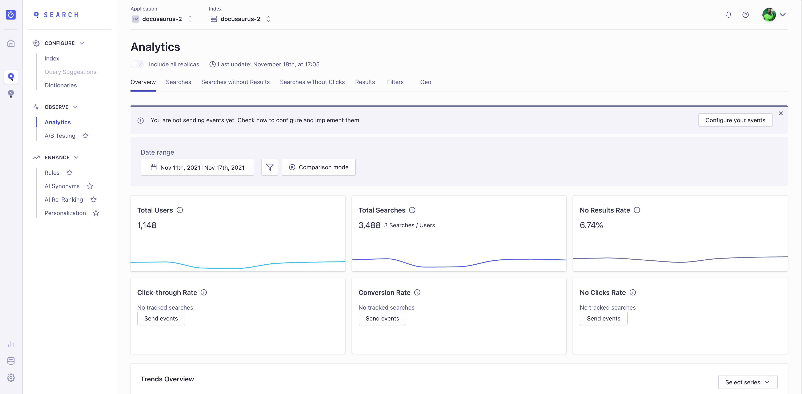

[DocSearch](https://docsearch.algolia.com/) 正在迁移至一个更强大的新系统，该系统将为用户提供专属的 Algolia 应用和新的凭证。

Docusaurus 站点所有者需在 **2022年2月1日之前** 使用新凭证升级配置，此后现有搜索索引将被冻结并转为只读模式。

<!--truncate-->

## 升级您的 Docusaurus 站点

未来几周内，Docusaurus 站点所有者将收到加入其专属 Algolia 应用的邀请邮件。

该邮件将包含用于 Docusaurus 配置的新 `appId` 和 `apiKey`。

您只需完成以下操作：

- 加入 Algolia 应用（可能需要创建新 Algolia 账户）
- 更新站点配置。

```js title="docusaurus.config.js"
const config = {
  themeConfig: {
    algolia: {
      // highlight-start
      appId: '<NEW_APP_ID>',
      apiKey: '<NEW_SEARCH_API_KEY>',
      // highlight-end
    },
  },
};

module.exports = config;
```

:::info

`appId` 现为**必填项**。

这些密钥并非敏感信息，可提交至 Git 仓库。

:::

## DocSearch 有了新家！

### 什么是 DocSearch？

[DocSearch](https://docsearch.algolia.com/) 是由 [Algolia](http://algolia.com/) 创建的项目，**免费**为开源项目技术文档和技术博客提供搜索服务。

您可[在此了解更多](https://docsearch.algolia.com/docs/what-is-docsearch/)，若想尝试可[立即申请](https://docsearch.algolia.com/apply)！

## 本次迁移涉及哪些内容？

### 迁移动机

随着 [DocSearch UI](https://docsearch.algolia.com/docs/DocSearch-v3) 稳定版的发布，我们希望进一步提供更强大的工具，帮助用户优化搜索体验并充分发挥 Algolia 的全部潜力。

### 新增功能

DocSearch 现采用 [Algolia 爬虫](https://www.algolia.com/products/search-and-discovery/crawler/)，其网页界面支持您：

- 启动、调度和监控爬取任务
- 通过实时编辑器修改配置文件
- 使用 DocSearch v3 测试搜索结果


此外，您的专属 Algolia 应用还支持更多功能：

- 团队管理
- 浏览并查看记录在 Algolia 中的索引方式
- 免费试用其他 Algolia 功能




当然，还有**更多免费功能**。

## 常见问题

### 我正在使用 Docusaurus 和 DocSearch，能否迁移？ {#im-using-docusaurus-and-docsearch-can-i-migrate}

本文撰写时，我们仍处于迁移早期阶段。目前每周处理少量批次，但将很快扩大规模，请保持耐心并留意邮箱通知，您的 Algolia 应用准备就绪后我们会立即联系您！

### 在哪里可以了解更多信息？

我们编写了一份简短的[迁移指南](https://docsearch.algolia.com/docs/migrating-from-legacy)，但您将在迁移邮件中获得更详细的信息。

### 我收到了迁移邮件但邀请已过期

请通过[邮件](mailto:docsearch@algolia.com)、[DocSearch的Discord](https://discord.gg/bRTacwYrfX)或[Docusaurus的Discord #algolia频道](https://discordapp.com/invite/docusaurus)联系我们

### 我有反馈意见！

对于文档或DocSearch UI组件的任何反馈，您可以在[GitHub仓库提交issue](https://github.com/algolia/docsearch/issues)，或通过上述方式联系我们。

### 我还能运行自己的DocSearch实例吗？

出于新基础设施和DocSearch v3的考虑，我们将不再维护我们心爱的[DocSearch爬虫](https://github.com/algolia/docsearch-scraper)和[DocSearch v2](https://github.com/algolia/docsearch/tree/master)，但这些仓库仍将开放并接受Pull Request。

之前的文档（现称为`legacy`）以及我们的[`自主运行`指南](https://docsearch.algolia.com/docs/legacy/run-your-own)仍然可用。