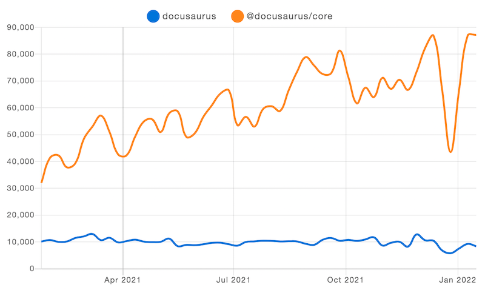

Docusaurus 在2021年取得了巨大进展！我们见证了强劲的增长势头，刚刚突破了**GitHub 30k星标**的里程碑！

随着[国际化功能的发布](/blog/2021/03-09-releasing-docusaurus-i18n.mdx)和[首个测试版的宣布](/blog/2021/05-12-announcing-docusaurus-two-beta/index.mdx)，我们已**实现与v1版本的功能全面对标**，今年更是迎来了**大量新用户**。

**v2正式版**即将发布！请关注[路线图议题](https://github.com/facebook/docusaurus/issues/6113)获取最新动态。

<!--truncate-->

## 年度亮点

让我们先回顾今年的重要进展。还记得半年前公布的[待办清单](/blog/2021/05-12-announcing-docusaurus-two-beta/index.mdx#whats-next)吗？现在正是检视成果的时刻！

- **国际化**：自2020年末初步落地后，经过四个月正式发布，已在[众多项目](/showcase?tags=i18n)中取得显著成效
- **自动生成侧边栏**：无需再维护庞大的`sidebars.js`文件
- **Webpack 5**：显著提升构建性能
- **尾部斜杠配置**：与任何内容托管服务实现无缝集成
- **重新设计的移动端导航**：移动用户现在可以享受与桌面端相同的导航功能
- **UI改进**：更易用的引用块、优化的警告提示、返回顶部按钮...
- **博客多作者支持**：为共同创作博文的贡献者们署名
- **更多博客功能**：归档页面、SEO结构化数据、订阅源包含全文——助您快速搭建功能完备的博客
- **资源就近放置**：无需臃肿的静态文件夹，可将图片与Markdown文件同目录存放
- **侧边栏分类索引页**：现在分类标签可关联具体页面，实现更优文档组织

我们的代码库也经过持续优化：测试覆盖率提升、所有包迁移至TypeScript、发布包体积最大缩减60%！

## 趋势分析

### npm数据

Docusaurus v2保持稳定增长。目前v2安装量已达v1的8倍。周下载量实现三倍增长(+209.4%)，从1月初的28,066次攀升至12月中旬的86,846次峰值。

（经典的圣诞季数据下滑...）

我们发布了18个版本，从`2.0.0-alpha.71`迭代至`2.0.0-beta.14`，平均每20天就有一次更新！

### GitHub数据

- **星标数**: 20,460 → 29,679（年增长率 +45.1%）。就在本文发布前夕，我们已突破 3 万星标！
- **总贡献者**: 512 → 773（年增长率 +51.0%）
- **依赖项目**: v2 版本从 5,039 增至 14,579（年增长率 +189.3%），v1 版本从 6,311 增至 7,581（年增长率 +20.1%）
- **代码提交**: 全年 1,187 次提交，平均每周 23 次
- **问题跟踪**: 619 个新开问题，其中 505 个已解决
- [**新增核心团队成员**](https://github.com/Josh-Cena)（没错就是我 😝）

我们的星标增长趋势同样亮眼。相较同类项目，我们保持着**更快的增速**：

凭借全年 8.4k 的星标增长，我们在本年度[JavaScript静态站点生成器新星榜](https://risingstars.js.org/2021/en#section-ssg)中位列第三，仅次于Next.js和Astro。

## 精选案例

我们的案例展示页新增了一批["精选"站点](/showcase?tags=favorite)，充分展现了Docusaurus 2可插拔架构的潜力。

- [**IOTA知识库**](https://wiki.iota.org/)

- [**Dyte文档**](https://docs.dyte.io/docs/home/introduction/)

- [**Ionic文档**](https://ionicframework.com/docs)

- [**Courier文档**](https://www.courier.com/docs/)

Docusaurus用户的创造力远超我们想象 🤩 期待更多采用者在发挥内容功能的同时，探索独特的主题设计！若您的站点使用Docusaurus，欢迎[提交至案例库](https://github.com/facebook/docusaurus/edit/main/website/src/data/users.tsx)。

## 社区生态

作为[Discord](https://discord.gg/docusaurus)的活跃管理员，我清晰见证了社区的蓬勃发展。许多常见问题现已整合进文档，部分功能需求也已实现。项目与社区形成了良性循环——正如我本人就是从社区贡献者成长为维护者的典型案例。

我们在X平台上持续收获热情反馈：

> **@docusaurus** 太惊艳了！难以置信竟如此简单易用。

> 无需额外插件、工具或编译步骤，开箱即用。

> 我热爱**@docusaurus**。若没有它，我无法如此高效优雅地构建站点中的API文档、教程和博客体系。

我们把这些珍贵的反馈都收藏在[专属空间](https://x.com/sebastienlorber/timelines/1392048416872706049)里 😄 如果你也喜欢Docusaurus，欢迎继续用标签分享你的使用感受！

随着正式版发布的临近，我们更想了解开发者们的实际应用场景：[插件开发者](https://github.com/facebook/docusaurus/discussions/4025)、[深度定制站点创作者](https://github.com/facebook/docusaurus/discussions/5468)以及[所有新用户](https://github.com/facebook/docusaurus/discussions/4610)——请持续分享你们的成果，这将指引我们优化产品方向。

## 未来规划

过去几个月我们持续讨论的发布候选阶段即将完成。我们建立了专项[里程碑](https://github.com/facebook/docusaurus/milestone/15)来追踪所有待解决问题。核心目标是构建**更健壮的主题工作流**，让创意开发者能安全地定制默认主题而不必担心升级时的破坏性变更。具体包括：

- **组件结构规范**。通过合理划分主题组件粒度，确保每个定制需求都有对应组件可用  
- **增强swizzle CLI工具**。优化交互体验，覆盖所有可能的组件替换场景  
- **重构主题API**。将非UI逻辑从可替换组件中剥离，确保所有swizzle操作都针对视觉元素  
- **文档体系升级**。采用渐进式教程结构，兼顾零基础用户与资深开发者的学习路径

更多细节可查阅[路线图issue](https://github.com/facebook/docusaurus/issues/6113)。2.0版本的完善离不开社区力量，欢迎在相关议题下提出建议！

核心团队全力推进正式版的同时，我们计划在2.0之后通过小版本迭代更多实用功能，并为[3.0版本架构改革](https://github.com/facebook/docusaurus/milestone/16)制定了长远规划。

随着Docusaurus 2.0正式发布，我们预期将迎来大规模新用户和v1迁移浪潮。

衷心感谢2021年度所有贡献者：

- 核心团队：[Alexey Pyltsyn](https://github.com/lex111)、[Sébastien Lorber](https://github.com/slorber)、[Joshua Chen](https://github.com/Josh-Cena)和[Yangshun Tay](https://github.com/yangshun)的社区管理、技术布道、问题排查与新功能开发  
- 创始人[Joel Marcey](https://github.com/JoelMarcey)的持续支持  
- Algolia团队协助用户[迁移DocSearch](/blog/2021/11-21-algolia-docsearch-migration/index.mdx)并解答搜索相关问题  
- 所有积极参与代码贡献、文档改进及Discord答疑的社区成员

告别2021，让我们共同迎接更精彩的2022！