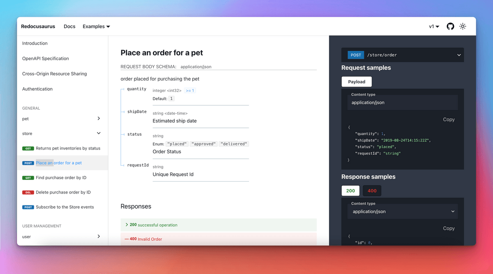
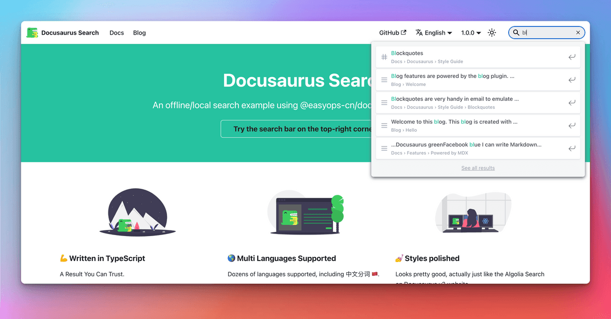

import LiteYouTubeEmbed from 'react-lite-youtube-embed';
import 'react-lite-youtube-embed/dist/LiteYouTubeEmbed.css';
import BrowserWindow from '@site/src/components/BrowserWindow';
import ProductHuntCard from '@site/src/components/ProductHuntCard';
import HackerNewsIcon from '@site/src/components/HackerNewsIcon';
import ColorModeToggle from '@theme/Navbar/ColorModeToggle';
import useBaseUrl from '@docusaurus/useBaseUrl';
import ThemedImage from '@theme/ThemedImage';
import {ShowcaseCarouselV1, ShowcaseCarouselV2, ShowcaseCarouselV2Theming} from './ShowcaseCarousel';

今天我们怀着无比激动的心情，正式宣布**Docusaurus 2.0发布**！🥳️

在[**Meta开源**](https://opensource.fb.com/)团队，我们相信Docusaurus能帮助您以**最小投入**打造**最佳文档网站**，让您专注于真正重要的事：内容创作。

历经**4年开发、[75个alpha版本](https://github.com/facebook/docusaurus/releases/tag/v2.0.0-alpha.75)和[22个beta版本](https://github.com/facebook/docusaurus/releases/tag/v2.0.0-beta.22)**，新一代Docusaurus已**正式就绪**。从今往后，我们将严格遵循[语义化版本规范](https://semver.org/)，并更频繁地发布**主版本更新**。


:::info[我们已登陆[ProductHunt](https://www.producthunt.com/posts/docusaurus-2-0)和[Hacker News](https://news.ycombinator.com/item?id=32303052)!]

**现在**正是向Docusaurus表达支持的最佳时机！

<div style={{display: 'flex'}}>
  <ProductHuntCard />
  <HackerNewsIcon />
</div>

:::

:::tip

赶时间？直接查看[Docusaurus 2.0新特性](#whats-new-in-20)！

:::

## Docusaurus究竟是什么？

Docusaurus是一款**静态网站生成器**，能帮助您**快速构建**精美的文档网站。

专注内容创作：只需编写**Markdown文件**，Docusaurus将为您生成易于**随处托管**的优化**网站**。

Docusaurus**功能全面**且高度**灵活**：我们提供设计精良的文档和博客布局，开箱即用的版本控制、搜索和国际化功能，并兼顾无障碍访问与搜索引擎优化。其灵活的**主题系统**可调整UI以匹配品牌形象，与主站或文档门户无缝集成。基于**React**的架构支持**现代化客户端导航**，并能构建**交互式文档**。


Docusaurus的哲学契合**帕累托法则**：以**20%的投入**获得**80%的成果**。这让您能用**最小成本**打造媲美顶尖水平的文档站点。

<TweetQuote
  url="https://x.com/rachelnabors/status/1452697991039660038"
  handle="rachelnabors"
  name="Rachel Nabors"
  job="Former ReactJS & React-Native docs manager">
  Unless you're spinning up a documentation team with engineering resources, you
  probably want Docusaurus!
</TweetQuote>

Docusaurus立志成为**最佳文档工具**，但您也可将其用于**其他场景**：博客、知识库、开发者作品集、第二大脑笔记系统，甚至快速搭建落地页！

<TweetQuote
  url="https://x.com/johnny_reilly/status/1551861926334025728"
  handle="johnny_reilly"
  name="Johnny Reilly"
  job="Group Principal Engineer at Investec">
  Using Docusaurus for my tech blog has been a fantastic choice. It looks
  tremendous out-of-the-box and the awesome DX means I write way more
</TweetQuote>

:::tip

立即通过[在线演练场](/docs/playground)和[5分钟教程](https://tutorial.docusaurus.io/)体验Docusaurus ⏱️

:::

## Docusaurus背后的故事

Docusaurus诞生于**2017年**的**Facebook开源团队**（现为[Meta开源](https://opensource.fb.com/)）。当时我们面临大量内部和开源项目的文档需求。编写优质文档本身已颇具挑战，更遑论还要构建美观网站的HTML、CSS和JavaScript。我们希望项目负责人能**专注于内容**，而**Markdown**正是理想选择。

彼时我们的解决方案是反复**复制粘贴Jekyll模板**。这显然导致**维护困难**，于是我们创建了这个工具来**一劳永逸地解决问题**。

**[Docusaurus v1 诞生了](/blog/2017/12-14-introducing-docusaurus.mdx)!**


它迅速在Facebook和前端生态系统中获得关注，被许多知名项目采用，如[Prettier](https://prettier.io/)、[Babel](https://babeljs.io/)、[React-Native](https://archive.reactnative.dev/)、[KaTeX](https://katex.org/docs/)，当然还有[Docusaurus v1](http://v1.docusaurus.io/)自身。

<ShowcaseCarouselV1 />

<br />

:::note

注意上述示例站点虽然使用了不同配色，但整体风格仍高度相似。

:::

## 迈向Docusaurus 2.0

[**Docusaurus v1**](http://v1.docusaurus.io/)曾取得巨大成功，但我们开始**反思其架构设计**：

- React仅作为**服务端模板语言**使用，未在客户端发挥作用
- **主题系统功能有限**，除通过CSS修改少量颜色外，难以实现深度定制
- **文档版本控制系统基于差异算法**，逻辑令人困惑
- 代码库**高度耦合**，既缺乏充分测试也难以扩展

[**Docusaurus v2**](https://docusaurus.io/)经过**彻底重构**，采用全新**模块化架构**：

- React现支持客户端渲染，实现**现代化单页应用导航体验**
- **插件系统**让社区可通过第三方包贡献功能
- **主题系统**的**灵活性**显著提升
- 文档版本控制改为基于快照拷贝，逻辑更直观
- 保留**v1全部核心功能**：文档、博客、页面、版本控制、国际化...
- 新增**多项创新特性**

更多细节参见[Docusaurus 2项目公告](/blog/2018/09-11-Towards-Docusaurus-2.mdx)和[v1到v2迁移指南](https://docusaurus.io/docs/migration)

## 谁在使用Docusaurus 2.0？

尽管处于预发布阶段，**Docusaurus v2的NPM下载量很快超越了v1**：

[](https://npmtrends.com/docusaurus-vs-@docusaurus/core)

我们的GitHub星标增长趋势积极，与主流框架比肩：

[](https://star-history.com/#facebook/docusaurus&vercel/next.js&gatsbyjs/gatsby&hexojs/hexo&nuxt/nuxt.js&vuejs/vuepress&11ty/eleventy&gohugoio/hugo&remix-run/remix&mkdocs/mkdocs&Timeline)

在正式发布前，Docusaurus v2已取得显著成功：

- 我们收到大量[热情用户反馈](https://x.com/sebastienlorber/timelines/1392048416872706049)
- [1Password](https://blog.1password.com/docusaurus-documentation-framework/)和[Courier](https://www.courier.com/blog/how-we-built-our-documentation/)等企业撰文分享积极体验
- [站点展示墙](/showcase)收录数百个案例，这仅是冰山一角

<ShowcaseCarouselV2 />

<br />

:::tip

欢迎将您的站点添加到我们的[站点展示墙](/showcase)！只需[在此提交评论](https://github.com/facebook/docusaurus/discussions/7826)，整个过程仅需几秒钟。

:::

<TweetQuote
  url="https://x.com/maxlynch/status/1549415692704825346"
  handle="maxlynch"
  name="Max Lynch"
  job="Ionic co-founder and CEO">
  We use Docusaurus everywhere now and love it
</TweetQuote>

<TweetQuote
  url="https://x.com/supabase/status/1328960757149671425"
  handle="supabase"
  name="Supabase"
  job="Open Source Firebase alternative">
  We've been using V2 since January and it has been great
</TweetQuote>

<TweetQuote
  url="https://x.com/gabrielcsapo/status/1415061312917233665"
  handle="gabrielcsapo"
  name="Gabriel Csapo"
  job="Staff Software Engineer at LinkedIn">
  Docusaurus is next level easy for literally everything you would need for
  documentation in your project.
</TweetQuote>

<TweetQuote
  url="https://x.com/ItWasMattGregg/status/1526682295075102721"
  handle="ItWasMattGregg"
  name="Matt Gregg"
  job="Senior Front End Developer at Shopify">
  Docusaurus is awesome. We use it
</TweetQuote>

## 2.0版本有哪些新特性？

很难逐一列举Docusaurus v2的所有新功能，我们将重点介绍最具影响力的特性。

### MDX支持

[MDX](https://github.com/mdx-js/mdx)允许您在Markdown中**嵌入React组件**，这使您能够轻松构建顶级的**交互式文档体验**。

示例胜于雄辩：

```md title="docs/my-document.mdx"
### Give it a try: press that button!

import ColorModeToggle from '@theme/ColorModeToggle';

<ColorModeToggle/>
```

<BrowserWindow>

<h3>Give it a try: press that button!</h3>

<ColorModeToggle/>

</BrowserWindow>

:::info

MDX拥有自己的[插件系统](https://mdxjs.com/docs/extending-mdx/)，您可以定制Markdown编写体验，甚至创建自己的Markdown语法。

:::

<TweetQuote
  url="https://x.com/HamelHusain/status/1551962275250053123"
  handle="HamelHusain"
  name="Hamel Husain"
  job="Head Of Data Science at Outerbounds">
  Docusaurus + MDX is great: we were able to implement a beautiful two-pane
  layout and give the author fine-grained control on the placement of code and
  corresponding prose.
</TweetQuote>

### 文件系统约定

我们的目标是让Docusaurus使用起来非常直观。通过引入文件系统约定，添加文档页面就像创建一个Markdown文件那么简单。

<LiteYouTubeEmbed
  id="T3S8GyFIXjo"
  params="autoplay=1&autohide=1&showinfo=0&rel=0"
  title="Explain Like I'm 5: Docusaurus"
  poster="maxresdefault"
  webp
/>

<br />

<TweetQuote
  url="https://x.com/paularmstrong/status/1552005085168865281"
  handle="paularmstrong"
  name="Paul Armstrong"
  job="Principal Engineer at Microsoft">
  Using the auto-generated sidebars makes it so simple to just create a page and
  not worry about any other configuration.
</TweetQuote>

### 插件系统

Docusaurus现在采用**模块化架构**和插件系统——包括文档、博客、页面和搜索在内的**核心功能**都由独立插件驱动。

更重要的是，这使社区能够通过附加功能**增强Docusaurus**。

以下是一些典型示例：

- [redocusaurus](https://github.com/rohit-gohri/redocusaurus)：无缝集成[OpenAPI](https://www.openapis.org/)和[Redoc](https://github.com/Redocly/redoc)



- [docusaurus-preset-shiki-twoslash](https://www.npmjs.com/package/docusaurus-preset-shiki-twoslash)：使用[Shiki](https://github.com/shikijs/shiki)代码块语法高亮和[TwoSlash](https://shikijs.github.io/twoslash/) TypeScript编译器提示


<TweetQuote
  url="https://x.com/orta"
  handle="orta"
  name="Orta Therox"
  job="Former TypeScript core team at Microsoft">
  The plugin API was a breeze to use, and powerful enough that I could port the
  code sample renderer from the TypeScript website site in a couple of hours.
</TweetQuote>

- [docusaurus-search-local](https://github.com/easyops-cn/docusaurus-search-local)：内置Algolia插件的多种本地搜索替代方案之一



:::tip

我们在[社区资源](/community/resources)页面整理了精选的优质插件列表。

:::

<TweetQuote
  url="https://x.com/jodyheavener/status/1551974535452311552"
  handle="jodyheavener"
  name="Jody Heavener"
  job="Senior Developer at 1Password">
  The plugin system in Docusaurus v2 has made expanding 1Password's developer
  portal so easy and fun. Super excited to show you what we've got cooking up.
</TweetQuote>

### 主题系统

主题是Docusaurus最重要的功能之一：我们认为专业的文档站点应该**符合企业品牌形象**并保持体验一致性。

Docusaurus主题系统在多个层面提供高度**灵活性**：

- 通过CSS变量调整颜色、字体等样式
- 提供自定义CSS样式表
- 从头实现自己的主题
- **覆盖默认主题的任何React组件**：我们称之为[swizzling](https://docusaurus.io/docs/swizzling)

<TweetQuote
  url="https://x.com/hung_dev/status/1546918275065741312"
  handle="hung_dev"
  name="
Hung Viet Nguyen"
  job="Creator of JestPreview">
  I love Docusaurus Swizzling feature. It’s opinionated and flexible at the same
  time. This is super cool since a framework usually needs to sacrifice one for
  the other.
</TweetQuote>

这使得愿意投入更多时间进行**定制化**的用户能够构建出**与众不同**的网站。

<ShowcaseCarouselV2Theming />

<TweetQuote
  url="https://x.com/dabit3/status/1382855449813389315"
  handle="dabit3"
  name="Nader Dabit"
  job="Web3 developer, Developer DAO founder">
  So far it’s working out really nicely. It’s been really easy to style up the
  way that we wanted it to look. No blockers at all.
</TweetQuote>

### 其他特性

Docusaurus 2 提供了一系列实用功能：

- 主题：暗黑模式、优化的UI/UX、灵活的`themeConfig`选项...
- 文档版本控制：灵活的插件选项适配不同工作流
- 文档侧边栏：可折叠分类、分类索引页...
- 博客：多作者支持、作者映射、归档页...
- Markdown：标签页、数学公式、实时代码块、链接、灵活的前置元数据...
- 搜索：使用新版Algolia DocSearch 3体验
- 资源：便捷集成图片及其他文件类型
- 国际化：配置选项、默认主题翻译...
- 无障碍访问：aria标签、色彩对比度、跳过内容、键盘导航、渐进增强...
- SEO：合理默认值、易定制、规范URL、社交卡片、no-index、站点地图、微数据、hreflang...
- PWA：添加离线支持，支持安装为应用
- 快速失败机制：严格配置验证、检测失效链接、阻止错误的生产环境部署
- TypeScript支持：配置文件、插件、自定义页面和主题开发
- 演练场：通过[docusaurus.new](https://docusaurus.new)在浏览器快速体验
- Canary发布：使用@canary npm标签抢先体验新版本
- 测试：完善的测试体系，通过自用验证功能稳定性

<TweetQuote
  url="https://x.com/alexbdebrie/status/1540010328335032320"
  handle="alexbdebrie"
  name="Alex DeBrie"
  job="AWS Data Hero, author of The DynamoDB Book">
  Recently, I was shocked at how good Docusaurus is out of the box. Super solid,
  a good bit of configuration without being overwhelming, and the ability to
  really customize the styling if you're braver than I am.
</TweetQuote>

## 为何现在发布2.0？

许多关注者好奇**为何耗时4年才发布Docusaurus 2.0**，尽管测试版已取得成功且**广泛应用于生产环境**。

原因在于我们坚持**遵循[语义化版本控制](https://semver.org/)**，这意味着只要发布**破坏性变更**就会升级主版本号。

这至关重要：

- **保证次要版本升级的简易性**（只要使用[公共API](/community/release-process#public-api-surface)）
- 符合前端生态惯例
- 主版本更新是全面记录破坏性变更的契机
- 主/次版本更新可通过博文宣传新特性

问题在于灵活的皮肤系统天然形成了**隐式API边界**，导致**难以界定何为破坏性变更**。深度定制的网站在升级时可能遇到困难，因其使用了内部API。我们投入时间重构主题系统并明确定义[公共API](/community/release-process#public-api-surface)，使未来变更更安全。我们将持续扩展公共主题API，使常见定制不再依赖内部API。

:::info

今后Docusaurus将**更频繁发布主版本**，实际约**每2至4个月**发布一次。

[主版本号并非神圣不可变更](https://tom.preston-werner.com/2022/05/23/major-version-numbers-are-not-sacred.html)，但我们仍会集中处理破坏性变更，避免过频发布主版本。

详见[发布流程](/community/release-process)文档。

:::

## 未来规划


Docusaurus 3.0开发已启动，新版本将在数月内发布。我们会将**向后兼容的变更反向移植到2.x次要版本**，让社区能尽快通过稳定渠道使用。

以下是未来主版本路线图中的部分特性：

- [升级至 MDX 2.0](https://github.com/facebook/docusaurus/issues/4029)
- [改进 Markdown 基础设施](https://github.com/facebook/docusaurus/issues/4625)
- [优化主题与组件替换机制](https://github.com/facebook/docusaurus/issues/6114)
- [TailwindCSS 主题支持](https://github.com/facebook/docusaurus/issues/2961)
- [主题：支持自定义导航栏、文档侧边栏、博客侧边栏及页脚项目类型](https://github.com/facebook/docusaurus/issues/7227)
- [动态导航栏：导航项激活策略](https://github.com/facebook/docusaurus/issues/4389)
- [自定义社交卡片](https://github.com/facebook/docusaurus/issues/2968)
- [CSS-in-JS 支持](https://github.com/facebook/docusaurus/issues/3236)
- [采用 Node.js ES 模块](https://github.com/facebook/docusaurus/issues/6520)
- [提升构建时性能](https://github.com/facebook/docusaurus/issues/4765)
- [扩展 Docusaurus 插件与 CMS 集成](https://github.com/facebook/docusaurus/issues/4138)

## 致谢

我们要向[所有贡献者](https://github.com/facebook/docusaurus/graphs/contributors)表达诚挚谢意，包括：

- Docusaurus 核心团队：[Alexey Pyltsyn](https://github.com/lex111)、[Joshua Chen](https://github.com/Josh-Cena)、[Sébastien Lorber](https://github.com/slorber)、[Yangshun Tay](https://github.com/yangshun) 以及所有[前团队成员](https://docusaurus.io/community/team)
- [Joel Marcey](https://github.com/JoelMarcey) 创建了 Docusaurus 1.0 并在 Meta 开源项目中支持 Docusaurus 2.0 开发
- [Paul O’Shannessy](https://github.com/zpao) 在 Meta 开源项目中支持 Docusaurus 所有后续版本的开发
- [Eric Nakagawa](https://github.com/ericnakagawa) 设计了可爱的吉祥物 Slash
- [Endilie Yacop Sucipto](https://github.com/endiliey) 为 Docusaurus v2 的[初期开发](/blog/2020/01-07-tribute-to-endi.mdx)作出重大贡献
- [Clément Vannicatte](https://github.com/shortcuts)、[Kevin Granger](https://github.com/Shipow) 及整个 Algolia 团队的支持
- 所有社区成员提供的代码贡献、文档改进以及在 [Discord](https://discordapp.com/invite/docusaurus) 上的问题解答

特别感谢所有 **Docusaurus 2.0 早期采用者**，他们测试了 alpha、beta 和 canary 版本，提供了**极其宝贵的反馈**。我们衷心希望您有良好的使用体验，并期待您继续为即将发布的 Docusaurus 3.0 预发布版本提供反馈。

在 [Meta 开源项目](https://opensource.fb.com/)中，Docusaurus 是**最成功的项目之一**。我们迫不及待想看到您创建的优秀文档网站！别忘了**将它们提交至我们的[案例展示](/showcase)**！

**现在，尽情释放您的想象力吧 🤪！**

—— Slash

:::info[我们已登陆 [ProductHunt](https://www.producthunt.com/posts/docusaurus-2-0) 和 [Hacker News](https://news.ycombinator.com/item?id=32303052)]

🙏 欢迎与社区分享您的 Docusaurus 使用体验！

<div style={{display: 'flex'}}>
  <ProductHuntCard />
  <HackerNewsIcon />
</div>

:::

