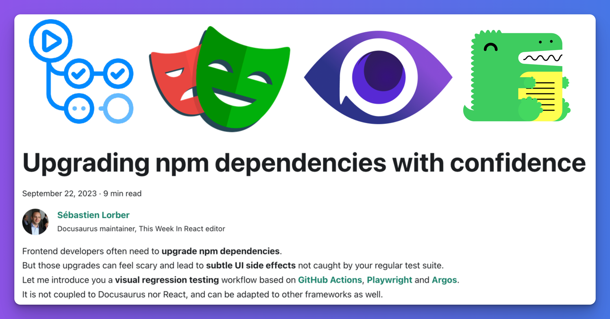
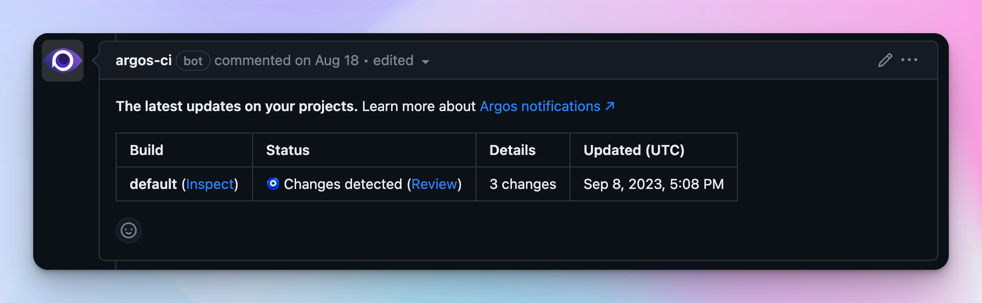

---
authors:
  - slorber
tags: [release]
slug: /upgrading-frontend-dependencies-with-confidence-using-visual-regression-testing
description: Upgrade npm dependencies with confidence thanks to a visual regression testing workflow using GitHub Actions, Playwright and Argos.
image: ./img/social-card.png
---

# 自信升级前端依赖项

前端开发者经常需要**升级 npm 依赖项**，但这些升级可能令人担忧，并导致常规测试套件无法捕获的**细微 UI 副作用**。

升级 Docusaurus 就是一个很好的例子：如果不逐一检查所有页面，很难确保没有视觉回归问题。**Docusaurus v3 即将发布**（当前处于 [beta 测试阶段](https://github.com/facebook/docusaurus/discussions/9312)），我们希望帮助您自信完成这次升级。

本文介绍基于 [**GitHub Actions**](https://github.com/features/actions)、[**Playwright**](https://playwright.dev/) 和 [**Argos**](https://argos-ci.com/) 的**视觉回归测试**工作流。该方案不与 Docusaurus 或 React 强耦合，可适配其他前端应用和框架。



<!--truncate-->

该工作流已在 Docusaurus v2 升级至 v3 过程中验证，并成功捕获 [React Native](https://reactnative.dev/)、[Jest](https://jestjs.io/) 和 [Docusaurus](https://docusaurus.io/) 官网等站点的若干视觉回归问题。

Docusaurus v3 包含基础设施变更及重大依赖升级（如 [MDX v3](https://mdxjs.com/blog/v3/) 和 [React 18](https://react.dev/blog/2022/03/29/react-v18)），可能产生意外副作用。若无此类工作流，很难发现所有视觉回归问题。因此我们建议站点维护者考虑采用视觉回归测试，特别是高度定制化的站点。

## 工作流概览

核心思路非常简单：

- 使用 [GitHub Actions](https://github.com/features/actions) 在 CI 中构建站点
- 通过 [Playwright](https://playwright.dev/) 对 `sitemap.xml` 所有页面截图
- 将截图上传至 [Argos](https://argos-ci.com/)
- 对 Git 分支 `main` 和 `pr-branch` 分别执行上述操作
- 在 [Argos](https://argos-ci.com/) 中并排对比截图

Argos 会以 GitHub 提交状态和 PR 评论形式**报告 `main` 与 `pr-branch` 间的视觉差异**，帮助您提前自动化检测视觉回归问题。




Argos 生成对比报告，记录两个 Git 分支站点间的所有视觉差异，并提供便捷界面快速定位差异点。

访问 [Docusaurus Argos 页面](https://app.argos-ci.com/meta-open-source/docusaurus)查看我们的网站报告。

这是 Argos [检测到视觉回归问题](https://app.argos-ci.com/slorber/rnw-visual-tests/builds/32/56012838)的具体案例（来自 React-Native 网站升级）：

[](https://app.argos-ci.com/slorber/rnw-visual-tests/builds/32/56012838)

## 工作流实现

本节将分步详解工作流实现细节。

您需要先[注册 Argos 账号](https://app.argos-ci.com/signup)并[将 Argos 关联至 GitHub 仓库](https://argos-ci.com/docs/github)

### 依赖项

该工作流需要以下开发依赖项（除常规的Docusaurus依赖外）：

```bash
yarn add -D @argos-ci/cli @argos-ci/playwright @playwright/test cheerio
```

### GitHub Action配置

GitHub Action负责为每个Git分支执行工作流。

最小化的工作流配置示例如下：

```yaml title=".github/workflows/argos.yml"
name: Argos CI Screenshots

on:
  push:
    branches: [main]
  pull_request:
    branches: [main]

jobs:
  take-screenshots:
    runs-on: ubuntu-latest
    steps:
      - name: Check out repository code
        uses: actions/checkout@v4

      - name: Use Node.js
        uses: actions/setup-node@v3
        with:
          node-version: current

      - name: Install dependencies
        run: yarn install --frozen-lockfile

      - name: Install Playwright browsers
        run: yarn playwright install --with-deps chromium

      - name: Build the website
        run: yarn docusaurus build

      - name: Take screenshots with Playwright
        run: yarn playwright test

      - name: Upload screenshots to Argos
        run: yarn argos upload ./screenshots
```

### Playwright配置

Playwright负责对GitHub Action本地构建完成的网站进行截图。

最小化的[Playwright配置](https://playwright.dev/docs/test-configuration)示例如下：

```ts title="playwright.config.ts"
import {devices} from '@playwright/test';
import type {PlaywrightTestConfig} from '@playwright/test';

const config: PlaywrightTestConfig = {
  webServer: {
    port: 3000,
    command: 'yarn docusaurus serve',
  },
  projects: [
    {
      name: 'chromium',
      use: {
        ...devices['Desktop Chrome'],
      },
    },
  ],
};

export default config;
```

### Playwright测试脚本

仅配置Playwright还不够：我们还需编写Playwright测试文件来生成网站截图。

```ts title="screenshot.spec.ts"
import * as fs from 'fs';
import {test} from '@playwright/test';
import {argosScreenshot} from '@argos-ci/playwright';
import {extractSitemapPathnames, pathnameToArgosName} from './utils';

// Constants
const siteUrl = 'http://localhost:3000';
const sitemapPath = './build/sitemap.xml';
const stylesheetPath = './screenshot.css';
const stylesheet = fs.readFileSync(stylesheetPath).toString();

// Wait for hydration, requires Docusaurus v2.4.3+
// Docusaurus adds a <html data-has-hydrated="true"> once hydrated
// See https://github.com/facebook/docusaurus/pull/9256
function waitForDocusaurusHydration() {
  return document.documentElement.dataset.hasHydrated === 'true';
}

function screenshotPathname(pathname: string) {
  test(`pathname ${pathname}`, async ({page}) => {
    const url = siteUrl + pathname;
    await page.goto(url);
    await page.waitForFunction(waitForDocusaurusHydration);
    await page.addStyleTag({content: stylesheet});
    await argosScreenshot(page, pathnameToArgosName(pathname));
  });
}

test.describe('Docusaurus site screenshots', () => {
  const pathnames = extractSitemapPathnames(sitemapPath);
  console.log('Pathnames to screenshot:', pathnames);
  pathnames.forEach(screenshotPathname);
});
```

<details>
  <summary>Why do we take screenshots with Argos instead of Playwright?</summary>

Argos has a [Playwright integration](https://argos-ci.com/docs/playwright) that wraps the original Playwright screenshot API and provides better defaults to make screenshots more deterministic.

</details>

<details>
<summary>What's inside <code>utils.ts</code>?</summary>

This module contains implementation details that we choose to hide for clarity.

```ts
import * as cheerio from 'cheerio';
import * as fs from 'fs';

// Extract a list of pathnames, given a fs path to a sitemap.xml file
// Docusaurus generates a build/sitemap.xml file for you!
export function extractSitemapPathnames(sitemapPath: string): string[] {
  const sitemap = fs.readFileSync(sitemapPath).toString();
  const $ = cheerio.load(sitemap, {xmlMode: true});
  const urls: string[] = [];
  $('loc').each(function handleLoc() {
    urls.push($(this).text());
  });
  return urls.map((url) => new URL(url).pathname);
}

// Converts a pathname to a decent screenshot name
export function pathnameToArgosName(pathname: string): string {
  return pathname.replace(/^\/|\/$/g, '') || 'index';
}
```

</details>

### 样式表处理

截图结果并非总是确定性的，对同一页面重复截图可能导致细微差异，这些差异会被Argos误报为**视觉回归问题**。

因此我们建议注入额外样式表来隐藏问题元素。您可能需要根据站点实际情况向基础样式表添加新的CSS规则。详情请参阅[Argos - 关于不稳定测试的文档](https://argos-ci.com/docs/about-flaky)。

```css title="screenshot.css"
/* Iframes can load lazily */
iframe,
/* Avatars can be flaky due to using external sources: GitHub/Unavatar */
.avatar__photo,
/* Gifs load lazily and are animated */
img[src$='.gif'],
/* Algolia keyboard shortcuts appear with a little delay */
.DocSearch-Button-Keys > kbd,
/* The live playground preview can often display dates/counters */
[class*='playgroundPreview'] {
  visibility: hidden;
}

/* Different docs last-update dates can alter layout */
.theme-last-updated,
/* Mermaid diagrams are rendered client-side and produce layout shifts */
.docusaurus-mermaid-container {
  display: none;
}
```

:::tip[防止布局偏移]

建议使用`display: none;`隐藏会导致布局偏移的不稳定UI元素。

例如文档页面的"最后更新于"可能显示为多行，从而将后续内容下推，导致Argos检测到大量像素差异。

:::

## 示例仓库

[slorber/docusaurus-argos-example](https://github.com/slorber/docusaurus-argos-example)仓库展示了在全新初始化的Docusaurus v2站点上使用Yarn monorepo实现该工作流的完整示例。

[](https://github.com/slorber/docusaurus-argos-example)

相关拉取请求：

- [PR - 配置GitHub Action + Playwright + Argos](https://github.com/slorber/docusaurus-argos-example/pull/1)：实现上述最小化工作流
- [PR - 从Docusaurus v2升级至v3](https://github.com/slorber/docusaurus-argos-example/pull/2)：展示Argos在升级过程中捕获的3处视觉回归问题

:::tip[需要更高级示例？]

参考Docusaurus仓库中的高级集成方案：

- [GitHub Action配置](https://github.com/facebook/docusaurus/blob/main/.github/workflows/argos.yml)
- [Playwright + Argos测试](https://github.com/facebook/docusaurus/tree/main/argos)

:::

## 成本控制

我们所选的工具仅是视觉回归测试工作流的具体实现方案。

对于Docusaurus，我们选择[Argos](https://argos-ci.com/)：它运行良好，并提供[免费](https://argos-ci.com/pricing)和[开源](https://argos-ci.com/docs/open-source)方案。当然您也可以选用其他工具。

若不介意在Git中存储大体积截图，您也可以尝试免费自托管的[Playwright视觉对比方案](https://playwright.dev/docs/test-snapshots)，通过`npx playwright show-report`查看差异。但我们发现专用外部工具更为便捷。

外部工具可能价格不菲，但通常提供免费套餐并包含充足的截图配额。通过实施以下技巧，您可以有效减少截图消耗量。

### 限制路径数量

基础配置会对`sitemap.xml`中的每个路径进行截图。对于大型站点，这可能导致截图数量激增。

您可以通过筛选路径，仅对最关键页面进行截图。

针对Docusaurus网站，建议不对版本化文档页面进行截图：

```ts title="screenshot.spec.ts"
// highlight-start
function isVersionedDocsPathname(pathname: string): boolean {
  return pathname.match(/^\/docs\/((\d\.\d\.\d)|(next))\//);
}
// highlight-end

test.describe('Docusaurus site screenshots', () => {
  const pathnames = extractSitemapPathnames(sitemapPath)
    // highlight-next-line
    .filter(isVersionedDocsPathname);

  pathnames.forEach(screenshotPathname);
});
```

### 限制工作流并发

通过配置[GitHub Actions并发组](https://docs.github.com/en/actions/using-jobs/using-concurrency)，可避免多次提交触发冗余的工作流执行。系统将仅处理最新提交，并自动取消先前提交的流程。

```yaml title=".github/workflows/argos.yml"
concurrency:
  group: ${{ github.workflow }}-${{ github.head_ref || github.run_id }}
  cancel-in-progress: true
```

### 按条件执行工作流

并非每次提交和拉取请求都需要运行此工作流。

例如当有人修正文档中的拼写错误时，您可能不需要拍摄数百张截图并通过Argos报告仅修改页面存在视觉差异——这完全在预期之中！

对于Docusaurus官网，我们仅对带有`Argos`标签的拉取请求执行工作流：

```yaml title=".github/workflows/argos.yml"
name: Argos CI Screenshots

on:
  push:
    branches: [main]
  pull_request:
    branches: [main]
    # highlight-start
    types:
      - opened
      - synchronize
      - reopened
      - labeled
    # highlight-end

jobs:
  take-screenshots:
    # highlight-start
    if: ${{ github.ref_name == 'main' || (github.event_name == 'pull_request' && contains(github.event.pull_request.labels.*.name, 'Argos')) }}
    # highlight-end
    runs-on: ubuntu-latest
    steps:
      # Your job steps here ...
```

您还可以探索更多选项，例如[手动触发工作流](https://docs.github.com/en/actions/using-workflows/manually-running-a-workflow)，或[仅当特定模式文件被修改时触发](https://docs.github.com/en/actions/using-workflows/triggering-a-workflow#example-including-paths)。

## 结语

我认为**视觉回归测试在前端生态中被严重低估**。

全页面截图是**唾手可得的低垂果实**，既易于设置又能帮助您**捕捉常规测试集遗漏的新型缺陷**。这项技术不仅适用于npm包升级，更能为**任何不应改变用户界面的重构**保驾护航。

何不立即尝试？

编码愉快！

## 扩展阅读

实用文档链接：

- [Playwright - 安装指南](https://playwright.dev/docs/intro)
- [Playwright - 测试配置指南](https://playwright.dev/docs/test-configuration)
- [Playwright - 测试配置API](https://playwright.dev/docs/api/class-testconfig)
- [Argos - 安装指南](https://argos-ci.com/docs/installation)
- [Argos - GitHub Actions集成](https://argos-ci.com/docs/github-actions)
- [Argos - Playwright集成](https://argos-ci.com/docs/playwright)
- [Argos - 关于不稳定测试](https://argos-ci.com/docs/about-flaky)