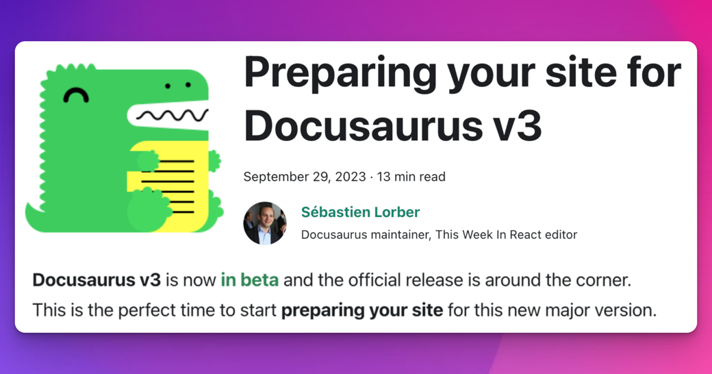

:::warning

本文撰写时 Docusaurus v3 尚处于测试阶段。若您计划升级至当前稳定版 Docusaurus v3，需注意依赖版本和升级步骤的变更。请参考[升级指南](https://docusaurus.io/docs/next/migration/v3)获取最新的迁移步骤。

:::

**Docusaurus v3** 现已进入[测试阶段](https://github.com/facebook/docusaurus/discussions/9312)，正式版即将发布。这正是为您的站点**预先适配**这一新主版本的最佳时机。

Docusaurus v3 包含若干**破坏性变更**，其中许多可在**当前 Docusaurus v2 环境下提前处理**。逐步完成站点适配工作将使未来的 v3 升级更加顺畅。

主要破坏性变更是从 MDX v1 升级至 MDX v3。请查阅 [**MDX v2**](https://mdxjs.com/blog/v2/) 和 [**MDX v3**](https://mdxjs.com/blog/v3/) 的发布说明了解详情。新版 MDX 将以**更严格的规范**和**细微差异**编译您的 Markdown 内容。

本文将重点指导如何为新的 MDX 版本准备内容，同时列出其他可立即处理的破坏性变更。



<!--truncate-->

:::warning

本文涵盖大部分 Docusaurus v3 破坏性变更，但并非完整清单。完整变更请参阅 [v3.0.0-beta.0 发布说明](https://github.com/facebook/docusaurus/discussions/9312)。

:::

:::tip[无需担忧]

虽然本文内容详实，但许多 Docusaurus v2 站点只需极少量修改即可完成升级。

若您的站点规模较小且自定义功能有限，或许可以立即[升级至 Docusaurus v3](#try-docusaurus-v3-today)。

:::

## 准备工作

在准备 Docusaurus v3 升级前，建议先升级至最新的 [Docusaurus v2 版本](/versions)。

根据站点复杂度，建议采用我们近期介绍的[可视化回归测试工作流](/blog/upgrading-frontend-dependencies-with-confidence-using-visual-regression-testing)。该方案可帮助捕捉 Docusaurus v3 升级过程中可能出现的意外视觉副作用。

我们同时建议：当您在 Markdown 文件中使用 JSX、`import` 或 `export`（即 MDX 特性）时，统一采用 `.mdx` 扩展名。这更符合语义规范，并能提升与外部工具（IDE、格式化程序、linter 等）的兼容性。未来 Docusaurus 版本中，`.md` 文件将作为标准 [CommonMark](https://commonmark.org/) 解析，不再支持这些特性。在 Docusaurus v3 中，`.md` 文件仍会被编译为 MDX 文件，但将支持[手动切换至 CommonMark](https://github.com/facebook/docusaurus/issues/3018)。

## 为 MDX v3 准备内容

MDX 是 Docusaurus 的核心依赖项，负责将您的 `.md` 和 `.mdx` 文件编译为 React 组件。

MDX v3 虽然更加强大，但也带来了可能需要内容重构的变更。新版 MDX 更加严格，某些在 v1 中能正常编译的组件可能在 v3 中编译失败，最常见的原因是 `{` 和 `<` 字符的使用问题。

升级 MDX 会带来 [MDX v2](https://mdxjs.com/blog/v2/) 和 [MDX v3](https://mdxjs.com/blog/v3/) 发布博客文章中记录的所有破坏性变更。大多数破坏性变更来自 MDX v2。[MDX v2 迁移指南](https://mdxjs.com/migrating/v2/)中有一个关于[如何更新 MDX 文件](https://mdxjs.com/migrating/v2/#update-mdx-files)的章节，这部分内容对我们尤其重要。同时请务必阅读[MDX 故障排除](https://mdxjs.com/docs/troubleshooting-mdx/)页面，它可以帮助你理解常见的 MDX 错误信息。

请确保同时阅读我们更新后的 [**MDX 与 React**](/docs/markdown-features/react) 文档页面。

:::tip[寻求帮助]

我们开设了专门的 [MDX v3 - 升级支持](https://github.com/facebook/docusaurus/discussions/9053)讨论区。

:::

### 使用 MDX 在线演练场

MDX 在线演练场将成为你的新朋友。它能帮助你理解内容如何被**编译为 React 组件**，并隔离排查编译或渲染问题。

每个 MDX 版本都有对应的演练场：

- [MDX 演练场 - 当前版本](https://mdxjs.com/playground/)
- [MDX 演练场 - v1](https://mdx-git-renovate-babel-monorepo-mdx.vercel.app/playground/)

<details>
  <summary>Configuring the MDX playground options for Docusaurus</summary>

To obtain a compilation behavior similar to what Docusaurus v2 uses, please turn on these options on the [MDX playground](https://mdxjs.com/playground/):

- Use `MDX`
- Use `remark-gfm`
- Use `remark-directive`


</details>

通过并排使用两个 MDX 演练场，你会很快注意到某些内容在 v3 中的编译结果不同或无法编译。

:::tip[使你的内容面向未来]

目标是通过重构有问题的内容，使其**能同时兼容两个版本的 MDX**。这样当你升级到 Docusaurus v3 时，这些内容就能直接开箱即用。

:::

### 使用 MDX 检查器 CLI

我们提供了 [docusaurus-mdx-checker](https://github.com/slorber/docusaurus-mdx-checker) 命令行工具，可以轻松定位有问题的内容。现在就可以在你的 Docusaurus v2 站点上运行该命令，获取将在 MDX v3 下编译失败的文件列表。

```bash
npx docusaurus-mdx-checker
```

对于每个编译问题，CLI 都会记录文件路径和需要查看的行号。


:::tip

使用此 CLI 可以预估使你的内容兼容 MDX v3 所需的工作量。

:::

:::warning

该 CLI 工具是尽力而为的方案，仅会报告编译错误。

它不会报告那些不产生错误但可能影响内容显示的细微编译变化。要捕获这些问题，我们推荐使用[视觉回归测试](/blog/upgrading-frontend-dependencies-with-confidence-using-visual-regression-testing)。

:::

### 常见 MDX 问题

我们已经将几个 Docusaurus 站点升级到 Docusaurus v3 和 MDX v3：

- [Docusaurus PR](https://github.com/facebook/docusaurus/pull/8288)
- [React-Native PR](https://github.com/facebook/react-native-website/pull/3780)
- [Jest PR](https://github.com/jestjs/jest/pull/14463)

通过这些升级，我们汇总了最常见的内容问题，并记录了最佳处理方案。

#### 错误使用 `{`

`{` 字符用于开启 [JavaScript 表达式](https://mdxjs.com/docs/what-is-mdx/#expressions)。如果 `{expression}` 中的内容不是有效表达式，MDX 现在会编译失败。

```md title="example.md"
The object shape looks like {username: string, age: number}
```

:::danger[错误信息]

> 无法使用 acorn 解析表达式：表达式后出现意外内容

:::

:::tip[如何提前适配]

修复此错误的可用方案：

- 使用行内代码：`{username: string, age: number}`
- 使用 HTML 编码：`&#123;`
- 使用转义符：`\{`

:::

#### 错误使用 `<` 符号

`<` 字符用于开启 [JSX 标签](https://mdxjs.com/docs/what-is-mdx/#jsx)。若 MDX 认为你的 JSX 无效，现在会直接报错。

```md title="example.md"
Use Android version <5

You can use a generic type like Array<T>

Follow the template "Road to <YOUR_MINOR_VERSION>"
```

:::danger[错误信息示例]

> 在名称前出现意外字符 `5` (U+0035)，期望是字母、`$` 或 `_` 等可开头字符

> 在段落结束前期望出现 `&lt;T&gt;` (1:6-1:9) 的闭合标签

> 在段落结束前期望出现 `&lt;YOUR_MINOR_VERSION&gt;` (134:19-134:39) 的闭合标签

:::

:::tip[如何提前适配]

修复此错误的可用方案：

- 使用行内代码：`Array&lt;T&gt;`
- 使用 HTML 编码：`&lt;` 或 `&#60;`
- 使用转义符：`\<`（注意在 MDX v1 下反斜杠会显示）

:::

#### 错误使用 GFM 自动链接

Docusaurus 支持 [GitHub 风味 Markdown (GFM)](https://github.github.com/gfm/)，但 MDX 不再支持使用 `&lt;link&gt;` 语法的[自动链接](https://github.github.com/gfm/#autolinks)。

```md title="example.md"
<sebastien@thisweekinreact.com>

<http://localhost:3000>
```

:::danger[错误信息示例]

> 名称中出现意外字符 `@` (U+0040)，期望是字母、数字、`$` 或 `_` 等名称字符（提示：在 MDX 中创建链接请使用 `[文本](url)`）

> 在局部名称前出现意外字符 `/` (U+002F)，期望是字母、`$` 或 `_` 等可开头字符（提示：在 MDX 中创建链接请使用 `[文本](url)`）

:::

:::tip[如何提前适配]

使用标准 Markdown 链接语法，或移除尖括号。MDX 和 GFM 本身已支持对字面量自动链接。

{/* prettier-ignore */}
```md title="示例.md"
sebastien@thisweekinreact.com
[sebastien@thisweekinreact.com](mailto:sebastien@thisweekinreact.com)

http://localhost:3000
[http://localhost:3000](http://localhost:3000)
```

:::

#### 小写形式的 MDXComponent 映射问题

对于自定义 [`MDXComponent` 映射](/docs/markdown-features/react#mdx-component-scope)的用户，组件现在会被"沙盒化"：

- 为 `h1` 定义的 `MDXComponent` 映射仅适用于 `# 标题` 而不适用于 `&lt;h1&gt;标题&lt;/h1&gt;`
- **小写形式**的自定义元素名将不再被对应的 `MDXComponent` 组件替换

:::danger[视觉差异]

你的 [MDXComponent 组件映射](/docs/markdown-features/react#mdx-component-scope)可能不再像以前那样生效，自定义组件可能不再被调用。

:::

:::tip[如何准备]

对于原生 Markdown 元素，可以继续使用**小写形式**：`p`、`h1`、`img`、`a`...

对于其他任何元素，**请使用大写名称**。

```diff title="src/theme/MDXComponents.js"
 import MDXComponents from '@theme-original/MDXComponents';

 export default {
   ...MDXComponents,
   p: (props) => <p {...props} className="my-paragraph"/>
-  myElement: (props) => <div {...props} className="my-class" />,
+  MyElement: (props) => <div {...props} className="my-class" />,
 };
```

:::

#### 意外产生的额外段落

在 MDX 中，现在可以更轻松地交错使用 JSX 和 Markdown，而无需额外的换行符。在多行编写内容时也可能生成预期之外的 `<p>` 标签。

:::danger[视觉差异]

观察以下内容在 MDX v1 和 v3 中的渲染差异：

```md title="example.md"
<div>Some **Markdown** content</div>
<div>
  Some **Markdown** content
</div>
```

{/* prettier-ignore */}
```html title="MDX v1 输出"
<div>Some **Markdown** content</div>
<div>Some **Markdown** content</div>
```

{/* prettier-ignore */}
```html title="MDX v3 输出"
<div>Some <strong>Markdown</strong> content</div>
<div><p>Some <strong>Markdown</strong> content</p></div>
```

:::

:::tip[如何准备]

若不需要额外的 `<p>` 标签，可逐例重构为单行 JSX 标签：

```diff
 <figure>
   
-  <figcaption>
-    My image caption
-  </figcaption>
+  <figcaption>My image caption</figcaption>
 </figure>
```

若内容包含 "Markdown 内联元素"（`**`、`*`、`_`、`[link](/path)`），可能无法提前重构，需随 Docusaurus v3 升级同步处理。

:::

#### 指令的意外使用

Docusaurus v3 现采用 [Markdown 指令](https://talk.commonmark.org/t/generic-directives-plugins-syntax/444)（通过 [remark-directive](https://github.com/remarkjs/remark-directive) 实现）作为支持告示框等功能的通用方案。

```md title="example.md"
This is a :textDirective

::leafDirective

:::containerDirective

Container directive content

:::
```

:::danger[视觉变化]

指令会被解析以供其他 Remark 插件处理。未处理的指令将被忽略，且不会以原始形式渲染。

```md title="example.md"
The AWS re:Invent conf is great
```

由于 `:Invent` 被解析为文本指令，现在会渲染为：

```
The AWS re
conf is great
```

:::

:::tip[如何准备]

- 使用 HTML 编码：`&#58;`
- 在 `:` 后添加空格（若语义允许）：`: text`
- 转义字符：`\:`（MDX v1 下反斜杠会显示）

:::

#### 不再支持缩进式代码块

MDX 不再将缩进文本转换为代码块。

```md title="example.md"
    console.log("hello");
```

:::danger[视觉变化]

升级通常不会引发新的 MDX 编译错误，但可能导致内容以意外方式渲染，因为不再生成代码块。

:::

:::tip[如何准备]

使用标准代码块语法替代缩进：

````md title="example.md"
```js
console.log('hello');
```
````

:::

### MDX 插件

MDX生态系统中所有官方包（Unified、Remark、Rehype等）现已[**仅支持ES模块**](https://gist.github.com/sindresorhus/a39789f98801d908bbc7ff3ecc99d99c)，不再支持[CommonJS](https://nodejs.org/api/modules.html#modules-commonjs-modules)。

这意味着您无法再使用`require("remark-plugin")`语法。

:::tip[升级准备]

Docusaurus v3现支持[**ES模块**](https://flaviocopes.com/es-modules/)格式的配置文件。我们建议将配置文件迁移至ES模块，以便轻松导入Remark插件：

```js title="docusaurus.config.js"
import remarkPlugin from 'remark-plugin';

export default {
  title: 'Docusaurus',
  /* 在此使用remark插件的站点配置 */
};
```

若需继续使用CommonJS模块，可通过动态导入作为变通方案，实现在CommonJS模块中导入ES模块。幸运的是，[Docusaurus配置支持异步函数语法](/docs/configuration#syntax-to-declare-docusaurus-config)来实现此需求。

```js title="docusaurus.config.js"
module.exports = async function () {
  const myPlugin = (await import('remark-plugin')).default;
  return {
    // 站点配置...
  };
};
```

:::

:::info[插件开发者须知]

如果您创建了自定义Remark或Rehype插件，由于新版AST的结构变化，可能需要重构甚至完全重写这些插件。我们已开设[专门的支持讨论区](https://github.com/facebook/docusaurus/discussions/9337)来协助插件开发者升级代码。

:::

## 其他重大变更

除MDX外，还存在其他可预先准备的重大变更，特别是重要依赖项的主版本升级。

### Node.js 18.0

Node.js 16已[终止支持](https://nodejs.org/en/blog/announcements/nodejs16-eol)，Docusaurus v3现在要求**Node.js ≥ 18.0**。

:::tip[升级准备]

在升级至Docusaurus v3前，请先将Docusaurus v2站点升级至Node.js 18。

:::

### React 18.0

Docusaurus v3现在要求**React ≥ 18.0**。

React 18自带若干重大变更，根据站点中自定义React代码的数量，升级难度会有所不同。

仅使用官方主题代码且未进行swizzle操作的简单Docusaurus站点无需任何修改。

:::tip[升级准备]

阅读官方[React v18.0](https://react.dev/blog/2022/03/29/react-v18)和[升级React 18指南](https://react.dev/blog/2022/03/08/react-18-upgrade-guide)，检查您自主开发的React代码以确定哪些组件可能受此升级影响。

建议特别关注：
- 有状态组件的自动批处理功能
- 控制台报告的React hydration新错误

:::

### TypeScript 5.0

Docusaurus v3现在要求**TypeScript ≥ 5.0**。

:::tip[升级准备]

在升级至Docusaurus v3前，请先将Docusaurus v2站点升级至TypeScript 5。

:::

### TypeScript基础配置

官方Docusaurus TypeScript配置已从外部包[`@tsconfig/docusaurus`](https://www.npmjs.com/package/@tsconfig/docusaurus)重新内化至我们新的monorepo包[`@docusaurus/tsconfig`](https://www.npmjs.com/package/@docusaurus/tsconfig)。

这个新包与所有其他 Docusaurus 核心包版本同步，将用于确保 TypeScript 的向后兼容性及处理主版本升级时的破坏性变更。

:::tip[如何准备]

新的 Docusaurus v3 TypeScript 配置与之前的 Docusaurus v2 TypeScript 配置基本一致。如果您已升级到 TypeScript 5，在 v2 站点上使用 Docusaurus v3 配置是完全可行的：

```diff title="package.json"
 {
   "devDependencies": {
-    "@tsconfig/docusaurus": "^1.0.7",
+    "@docusaurus/tsconfig": "^3.0.0-beta.0",
   }
 }
```

```diff title="tsconfig.json"
 {
-  "extends": "@tsconfig/docusaurus/tsconfig.json",
+  "extends": "@docusaurus/tsconfig",
   "compilerOptions": {
     "baseUrl": "."
   }
 }
```

:::

### 警告提示框变更

由于历史原因，我们曾支持未文档化的红色 `:::warning` 警告提示框。

:::danger[警告]

这是 Docusaurus v2 的 `:::warning` 警告提示框。

:::

但其颜色和图标历来存在错误。Docusaurus v3 正式重新引入 `:::warning` 提示框，完善其文档，并修正了颜色和图标。

:::warning

这是 Docusaurus v3 的 `:::warning` 警告提示框。

:::

:::tip[如何准备]

若您曾使用未文档化的 `:::warning` 提示框，请逐一检查黄色是否仍适用。如需保留红色，请改用 `:::danger`。

Docusaurus v3 还[弃用了 `:::caution`](https://github.com/facebook/docusaurus/pull/9308) 提示框。请将 `:::caution`（黄色）重构为 `:::warning`（黄色）或 `:::danger`（红色）。

:::

### 版本化侧边栏

此破坏性变更仅影响 **在 v2.0.0-beta.10（2021年12月）前启用文档版本化** 的 Docusaurus v2 早期用户。

当创建版本 `v1.0.0` 时，侧边栏文件包含 `version-v1.0.0/` 前缀，而 [Docusaurus v3 不再支持此格式](https://github.com/facebook/docusaurus/pull/9310)。

```json title="versioned_sidebars/version-v1.0.0-sidebars.json"
{
  "version-v1.0.0/docs": [
    "version-v1.0.0/introduction",
    "version-v1.0.0/prerequisites"
  ]
}
```

:::tip[如何准备]

您的 Docusaurus v2 站点能同时处理两种侧边栏格式。

您可以从版本化侧边栏中移除冗余的版本前缀：

```json title="versioned_sidebars/version-v1.0.0-sidebars.json"
{
  "docs": ["introduction", "prerequisites"]
}
```

:::

## 立即体验 Docusaurus v3 {#try-docusaurus-v3-today}

Docusaurus v3 现已进入 [beta 阶段](https://github.com/facebook/docusaurus/discussions/9312)，并被 [React-Native](https://reactnative.dev)、[Jest](https://jestjs.io) 和[官网](https://docusaurus.io/)投入生产环境使用。

我们认为此版本 **稳定可靠且适合生产部署**，将在社区早期使用者反馈良好后正式发布。

若您尝试升级并在 [3.0.0-beta.0 发布讨论帖](https://github.com/facebook/docusaurus/discussions/9312) 中反馈问题，我们将不胜感激。

对多数站点而言，升级过程应较为简单。若您已按本文档提前准备，通常只需升级以下依赖：

```diff title="package.json"
 {
   "dependencies": {
-    "@docusaurus/core": "2.4.3",
-    "@docusaurus/preset-classic": "2.4.3",
-    "@mdx-js/react": "^1.6.22",
+    "@docusaurus/core": "3.0.0-beta.0",
+    "@docusaurus/preset-classic": "3.0.0-beta.0",
+    "@mdx-js/react": "^3.0.0",
     "clsx": "^2.0.0",
     "prism-react-renderer": "^1.3.5",
-    "react": "^17.0.2",
-    "react-dom": "^17.0.2"
+    "react": "^18.2.0",
+    "react-dom": "^18.2.0"
   },
   "devDependencies": {
-    "@docusaurus/module-type-aliases": "2.4.3"
+    "@docusaurus/module-type-aliases": "3.0.0-beta.0"
   }
 }
```

## 获取帮助

我们将通过以下支持渠道协助您完成升级：

- [Docusaurus v3 - 升级支持](https://github.com/facebook/docusaurus/discussions/9336)
- [Docusaurus v3 - Discord频道 #migration-v2-to-v3](https://discord.com/channels/398180168688074762/1154771869094912090)
- [MDX v3 - 升级支持](https://github.com/facebook/docusaurus/discussions/9053)
- [MDX v3 - Remark/Rehype插件支持](https://github.com/facebook/docusaurus/discussions/9337)
- [MDX v3 - Discord频道 #migration-mdx-v3](https://discord.com/channels/398180168688074762/1116724556976111616)

您也可以选择付费的[Docusaurus服务提供商](https://github.com/facebook/docusaurus/discussions/9281)代为执行升级。如果您的站点是开源的，还可以向社区寻求[免费的善意帮助](https://github.com/facebook/docusaurus/discussions/9283)。

## 结语

Docusaurus v3已进入试用阶段并将很快发布。本文已为您详细说明了升级所需的所有重大变更。

3.0初始版本主要聚焦于依赖项和基础设施升级，这将为我们实现激动人心的新功能奠定基础。同时该版本也包含了一些实用特性，我们将在最终版发布说明中详述。