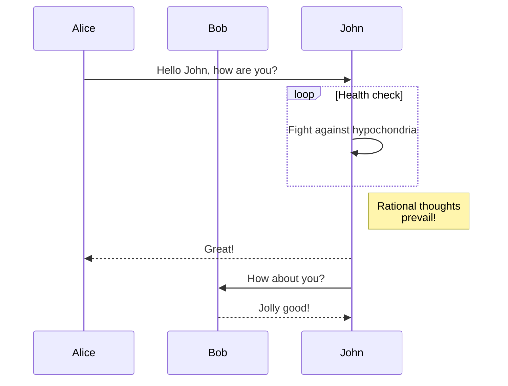

我们很高兴地宣布 **Docusaurus 2.2** 正式发布。

升级过程应该很顺利：正如我们的[发布流程文档](/community/release-process)所述，次要版本更新遵循[语义化版本控制](https://semver.org/)规范。


## 重点更新

### Mermaid 图表支持

在 [#7490](https://github.com/facebook/docusaurus/pull/7490) 中，我们新增了对 Mermaid 图表的支持。这弥补了与 GitHub Flavored Markdown 的差异，后者也[于近期添加了该功能](https://github.blog/2022-02-14-include-diagrams-markdown-files-mermaid/)。您可以使用 Markdown 代码块创建 Mermaid 图表：

````md

````

import BrowserWindow from '@site/src/components/BrowserWindow';

<BrowserWindow>


</BrowserWindow>

请务必查阅[相关文档](/docs/markdown-features/diagrams)以及[更高级的示例](/tests/pages/diagrams)

### 配置项 `headTags`

在 [#8151](https://github.com/facebook/docusaurus/pull/8151) 中，我们新增了为所有页面应用任意 HTML `<head>` 标签的功能。

```js title="docusaurus.config.js"
module.exports = {
  headTags: [
    {
      tagName: 'link',
      attributes: {
        rel: 'icon',
        href: '/img/docusaurus.png',
      },
    },
  ],
};
```

### 无障碍优化

我们进行了多项无障碍功能改进：

- [#8207](https://github.com/facebook/docusaurus/pull/8207)：优化移动端抽屉菜单汉堡按钮的键盘导航
- [#8161](https://github.com/facebook/docusaurus/pull/8161)：优化标签页的键盘导航
- [#8204](https://github.com/facebook/docusaurus/pull/8204)：使"跳过内容"按钮支持渐进增强
- [#8174](https://github.com/facebook/docusaurus/pull/8174)：改进切换明暗模式时的屏幕阅读器播报

### 开发者体验

我们加强了验证机制并改进了错误提示：

- [#8234](https://github.com/facebook/docusaurus/pull/8234)：文档处理失败时，错误信息中会显示有问题的 Markdown 文件路径
- [#8192](https://github.com/facebook/docusaurus/pull/8192) 和 [#8159](https://github.com/facebook/docusaurus/pull/8159)：更严格地验证 `siteConfig.url` 并提供更清晰的错误提示
- [#8066](https://github.com/facebook/docusaurus/pull/8066)：使配置中的 `url` 和 `baseUrl` 更健壮，对首尾斜杠的处理更灵活

### 多语言翻译

我们完成了默认主题对多语言的翻译支持：

- 🇹🇷 [#8105](https://github.com/facebook/docusaurus/pull/8105)：完成土耳其语翻译
- 🇷🇺 [#8253](https://github.com/facebook/docusaurus/pull/8253)：完成俄语翻译
- 🇫🇷 [#8243](https://github.com/facebook/docusaurus/pull/8243)：完成法语翻译
- 🇯🇵 [#8075](https://github.com/facebook/docusaurus/pull/8075)：完成日语翻译

:::tip

主题翻译是[持续进行的工作](https://github.com/facebook/docusaurus/issues/3526)，也是为 Docusaurus 做贡献的便捷方式。我们会定期新增主题功能，通常[需要新的翻译支持](https://github.com/facebook/docusaurus/issues/3526)。

:::

## 其他变更

其他值得注意的更新包括：

- [#8210](https://github.com/facebook/docusaurus/pull/8210): `docusaurus swizzle` CLI 新增 `--config` 选项
- [#8109](https://github.com/facebook/docusaurus/pull/8109): 移动端导航性能优化，提前预加载资源
- [#8059](https://github.com/facebook/docusaurus/pull/8059): 版本/语言导航栏下拉菜单在跳转时保留哈希值和查询字符串
- [#8227](https://github.com/facebook/docusaurus/pull/8227): 客户端重定向插件在跳转时保留哈希值和查询字符串

查看 **[2.2.0 版本变更日志](/changelog/2.2.0)** 获取完整的变更列表。