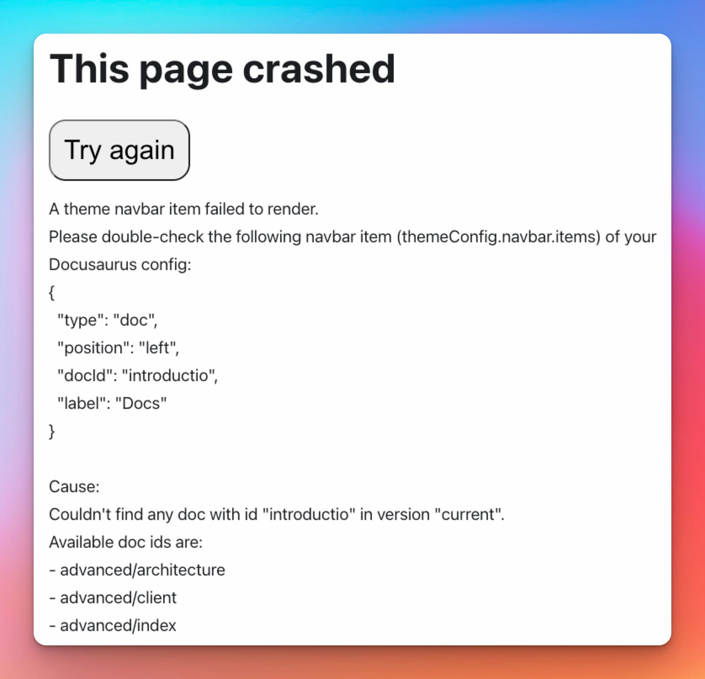

我们很高兴地宣布 **Docusaurus 2.4** 正式发布。

升级过程应该很简单：正如我们的[发布流程文档](/community/release-process)所述，次要版本遵循[语义化版本控制](https://semver.org/)规范。


<!--truncate-->

import BrowserWindow from '@site/src/components/BrowserWindow';
import IframeWindow from '@site/src/components/BrowserWindow/IframeWindow';
import ErrorBoundaryTestButton from '@site/src/components/ErrorBoundaryTestButton';

## 重点更新

### 侧边栏项目描述

在 [#8236](https://github.com/facebook/docusaurus/pull/8236) 中，我们为文档侧边栏中类型为 `link` 和 `category` 的项目新增了 `description` 属性支持。

```tsx title="sidebars.js"
[
  {
    type: 'link',
    label: 'Link with description',
    href: 'https://docusaurus.io',
    // highlight-next-line
    description: 'Some link description',
  },
  {
    type: 'category',
    label: 'Category with description',
    // highlight-next-line
    description: 'Some category description',
    items: [],
  },
];
```

这些描述将用于分类生成的索引页面。


### 主题查询参数

在 [#8708](https://github.com/facebook/docusaurus/pull/8708) 中，我们新增了通过 `docusaurus-theme` 查询字符串参数强制 Docusaurus 以 `light` 或 `dark` 模式初始化的功能。

这对于在 iframe 或 WebView 中嵌入现有 Docusaurus 页面时确保主题一致性非常有用。

<IframeWindow url="/docs/?docusaurus-theme=light" />

<IframeWindow url="/docs/?docusaurus-theme=dark" />

### Remark 插件 npm2yarn 升级

在 [#8690](https://github.com/facebook/docusaurus/pull/8690) 中，我们升级了 Remark 插件 [@docusaurus/remark-plugin-npm2yarn](https://github.com/facebook/docusaurus/tree/main/packages/docusaurus-remark-plugin-npm2yarn)，修复了多个转换错误，新增了对 pnpm 的一流支持，并支持注册自定义转换器以生成新标签页。

````markdown
Run these commands!

```bash npm2yarn
npm install
npm run build
npm run myCustomScript -- --some-arg
```
````

<BrowserWindow>

```bash npm2yarn
npm install
npm run build
npm run myCustomScript -- --some-arg
```

</BrowserWindow>

### 支持多跟踪 ID 的 gtag

在 [#8620](https://github.com/facebook/docusaurus/pull/8620) 中，我们为 [@docusaurus/plugin-google-gtag](/docs/api/plugins/@docusaurus/plugin-google-gtag) 插件新增了声明多个跟踪 ID 的支持。

```js title="docusaurus.config.js"
module.exports = {
  presets: [
    [
      '@docusaurus/preset-classic',
      {
        gtag: {
          trackingID: [
            // highlight-next-line
            'G-<YOUR-NEW-GA4-ID>',
            // highlight-next-line
            'UA-<YOUR-OLD-UA-ID>',
          ],
        },
      },
    ],
  ],
};
```

:::warning[Google 即将停止 Universal Analytics 服务]

**[Google 将于 2023 年 7 月 1 日停止其 Universal Analytics 服务](https://blog.google/products/marketingplatform/analytics/prepare-for-future-with-google-analytics-4/)**。

Docusaurus 用户应迁移至 Google Analytics 4。Google **不允许将现有 Universal Analytics 数据迁移**到新的 Google Analytics 4 属性。

为保持分析数据的连续性，我们暂时建议您同时向两个跟踪 ID 报告事件：旧 ID（`UA-*`）和新 ID（`G-*`）。详情请参阅**[专属问题](https://github.com/facebook/docusaurus/issues/7221)**。

:::

### 开发者体验

在 [#8736](https://github.com/facebook/docusaurus/pull/8736) 中，我们改进了错误信息的呈现方式，并新增了对显示完整错误因果链的初步支持（参见 [ES2022 错误原因](https://h3manth.com/ES2022/#error-cause)）。

:::tip

点击此处查看实际效果：<ErrorBoundaryTestButton cause="可能是未定义不是一个函数 😄"/>

:::

在 [#8735](https://github.com/facebook/docusaurus/pull/8735) 中，我们还使导航栏相关错误信息更加清晰，帮助用户理解出错原因。



### 国际化

我们新增了对以下元素的翻译支持：

- [#8677](https://github.com/facebook/docusaurus/pull/8677) 引入了实验性环境变量 `process.env.DOCUSAURUS_CURRENT_LOCALE`，允许对配置文件进行本地化，包括站点标题、标语、公告栏、基础URL等
- [#8616](https://github.com/facebook/docusaurus/pull/8616) 实现了导航栏和页脚Logo替代文本的翻译支持

我们为以下语言新增了默认主题翻译支持：

- 🇭🇺 [#8668](https://github.com/facebook/docusaurus/pull/8668): 匈牙利语
- 🇳🇴 [#8631](https://github.com/facebook/docusaurus/pull/8631): 挪威语（书面挪威语）

:::tip

完善主题翻译是[持续进行的工作](https://github.com/facebook/docusaurus/issues/3526)，也是为Docusaurus做贡献的便捷方式。我们会定期新增主题功能，这些功能通常[需要新的翻译](https://github.com/facebook/docusaurus/issues/3526)。

:::

## 其他变更

其他值得注意的变更包括：

- [#8674](https://github.com/facebook/docusaurus/pull/8674): 遵循 `prefers-reduced-motion: reduce` 媒体查询
- [#8712](https://github.com/facebook/docusaurus/pull/8712): 在模板中使用类型为 `docSidebar` 的导航栏项目
- [#8801](https://github.com/facebook/docusaurus/pull/8801): 允许标签页子元素为假值
- [#8757](https://github.com/facebook/docusaurus/pull/8757): 使搜索页面响应外部查询字符串变化
- [#8803](https://github.com/facebook/docusaurus/pull/8803): 修复RTL布局下代码块按钮位置
- [#8615](https://github.com/facebook/docusaurus/pull/8615): 修复使用深色导航栏时的色彩模式切换问题
- [#8699](https://github.com/facebook/docusaurus/pull/8699): 修复导航栏下拉菜单标签焦点错误

完整变更列表请查看 **[2.4.0版本更新日志](/changelog/2.4.0)**。