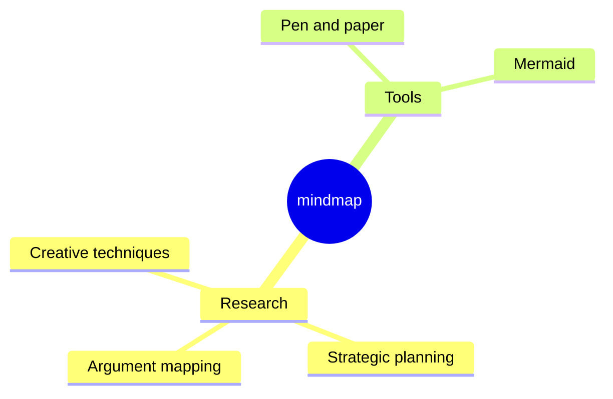

今天，我们很高兴地宣布 **Docusaurus 3.0 正式发布**！🎉

在 [**Meta 开源团队**](https://opensource.fb.com/) 看来，Docusaurus 能帮助您以 **最小成本** 构建 **最佳文档网站**，让您专注于真正重要的事情：内容创作。

这是 Docusaurus 的 **全新主版本**，带来了 **激动人心的新功能** 和升级的依赖项。

遵循 [**语义化版本控制**](https://semver.org/) 原则，本次发布包含 **重大变更**，我们已在 [**v3 迁移指南**](/docs/migration/v3/) 中详细说明。虽然重大变更可能带来不便，但它们为 Docusaurus 即将实现的 **新功能浪潮** 奠定了基础。


我们原计划更频繁地发布主版本，但 Docusaurus v3 的开发周期超出预期。在积累的诸多重大变更中，**升级至 MDX v3** 可能是本次版本升级的主要挑战。我们付出了额外努力使升级过程尽可能顺畅，特别是通过添加 [对 MDX v1 的兼容性选项](/docs/api/docusaurus-config#markdown)。

最简单的项目仅需升级少量 npm 依赖项。对于更复杂的项目，我们提供了几种策略帮助您更自信地完成升级：

- 提前 [准备您的站点](/blog/preparing-your-site-for-docusaurus-v3)，在保持 Docusaurus v2 的同时逐步实施升级
- 通过 [设置视觉回归测试](/blog/upgrading-frontend-dependencies-with-confidence-using-visual-regression-testing) 捕捉升级过程中意外的视觉变化

:::info[关于 Docusaurus v2]

根据我们的 [发布流程](/community/release-process)，Docusaurus v2 现已进入 **维护模式**。在 2024 年 1 月 31 日前的 3 个月内，仅会针对重大安全问题提供支持。建议您在此期间升级至 v3 版本。

:::

import IframeWindow from '@site/src/components/BrowserWindow/IframeWindow';

## 重大变更

本节仅提供快速概览。所有重大变更均已在 [**v3 迁移指南**](/docs/migration/v3) 中完整记录。

Docusaurus v3 将多个依赖项升级至新的主版本，每个版本都包含自身的重大变更：

- Node.js v16 ➡️ v18
- React v17 ➡️ v18
- MDX v1 ➡️ v3
- TypeScript v4 ➡️ v5
- prism-react-renderer v1 ➡️ v2
- react-live v2 ➡️ v4
- Mermaid v9 ➡️ v10
- import-fresh v3 ➡️ jiti v1
- remark-emoji v2 ➡️ v4

典型的 `package.json` 依赖项升级示例如下：

```diff title="package.json"
 {
   "dependencies": {
     // upgrade to Docusaurus v3
-    "@docusaurus/core": "2.4.3",
-    "@docusaurus/preset-classic": "2.4.3",
+    "@docusaurus/core": "3.0.0",
+    "@docusaurus/preset-classic": "3.0.0",
     // upgrade to MDX v3
-    "@mdx-js/react": "^1.6.22",
+    "@mdx-js/react": "^3.0.0",
     // upgrade to prism-react-renderer v2.0+
-    "prism-react-renderer": "^1.3.5",
+    "prism-react-renderer": "^2.1.0",
     // upgrade to React v18.0+
-    "react": "^17.0.2",
-    "react-dom": "^17.0.2"
+    "react": "^18.2.0",
+    "react-dom": "^18.2.0"
   },
   "devDependencies": {
     // upgrade Docusaurus dev dependencies to v3
-    "@docusaurus/module-type-aliases": "2.4.3",
-    "@docusaurus/types": "2.4.3"
+    "@docusaurus/module-type-aliases": "3.0.0",
+    "@docusaurus/types": "3.0.0"
   }
   "engines": {
     // require Node.js 18.0+
-    "node": ">=16.14"
+    "node": ">=18.0"
   }
 }
```

除 MDX v3 外，这些升级依赖项带来的大多数重大变更已由我们内部处理：通常情况下您无需额外操作。在依赖项升级之外，明确来自 Docusaurus 代码库的功能性重大变更仅包括：

- [#9189](https://github.com/facebook/docusaurus/pull/9189)：博客 RSS 源默认条目数限制调整为 20 条
- [#9308](https://github.com/facebook/docusaurus/pull/9308)：修复并重新引入 `:::warning` 警告提示，弃用 `:::caution`
- [#9310](https://github.com/facebook/docusaurus/pull/9310)：移除旧版版本化侧边栏 ID 前缀（适用于 2021 年 12 月 `v2.0.0-beta.10` 之前版本化的站点）
- [#7966](https://github.com/facebook/docusaurus/pull/7966)：重构文档主题组件，最终需要您重新 swizzle 这些组件

## 重点更新

以下是此版本带来的部分实用新功能（非完整列表）。所有功能详情请参阅[**Docusaurus v3.0.0 发布说明**](https://github.com/facebook/docusaurus/releases/tag/v3.0.0)。

### Markdown

Docusaurus v3 从 MDX v1 升级至 MDX v3：

- 在 [#8288](https://github.com/facebook/docusaurus/pull/8288) 中升级至 [**MDX v2**](https://mdxjs.com/blog/v2/)（[迁移指南](https://mdxjs.com/migrating/v2/)）
- 在 [#9451](https://github.com/facebook/docusaurus/pull/9451) 中升级至 [**MDX v3**](https://mdxjs.com/blog/v3/)（[迁移指南](https://mdxjs.com/migrating/v3/)）

新版 MDX 为**内容创作者和插件开发者提供了极大改进**，并为实现激动人心的新 Markdown 功能奠定基础。

:::warning[MDX v3 - 主要挑战]

从 MDX v1 迁移至 MDX v3 是采用 Docusaurus v3 的**主要挑战**。

部分在 Docusaurus v2 下编译成功的文档可能在 Docusaurus v3 下**编译失败**，或呈现**不同渲染效果**。

大多数破坏性变更源自 [MDX v2](https://mdxjs.com/blog/v2/)，而 [MDX v3](https://mdxjs.com/blog/v3/) 的改动相对较小。[MDX v2 迁移指南](https://mdxjs.com/migrating/v2/)中关于[更新 MDX 文件](https://mdxjs.com/migrating/v2/#update-mdx-files)的章节尤为重要。同时请务必阅读[MDX 问题排查](https://mdxjs.com/docs/troubleshooting-mdx/)页面，该文档可帮助解读常见 MDX 错误信息。

**无需畏惧**。大多数问题**易于修复**，通常与需要转义的 `{` 和 `<` 字符相关。但根据站点规模，您可能需要修改大量文件而感到压力。为此，我们提供了 [`npx docusaurus-mdx-checker`](https://github.com/slorber/docusaurus-mdx-checker) 命令来评估工作量，并建议[提前准备站点](/blog/preparing-your-site-for-docusaurus-v3)。

若您创建过自定义 [MDX 插件](/docs/markdown-features/plugins)（Remark/Rehype），由于 AST 结构略有变化，可能需要重构这些插件。

:::

此次升级使我们能够新增[CommonMark 模式](/docs/markdown-features#mdx-vs-commonmark)，降低现有文档迁移至 Docusaurus 的难度。该功能目前为**实验性**且需手动启用（[部分 Docusaurus 功能将不可用](https://github.com/facebook/docusaurus/issues/9092)）。在 Docusaurus v3 中，所有文件仍被解析为 MDX，但我们计划在未来主版本中将 `.md` 文件解析为 CommonMark，并建议对使用 JSX 或 ES 模块的文件采用 `.mdx` 扩展名。

我们还引入了[全局配置 Markdown](/docs/api/docusaurus-config#markdown) 的新方式，后续将增加更多灵活配置选项。

```js title="docusaurus.config.js"
export default {
  markdown: {
    format: 'mdx',
    mermaid: true,
    preprocessor: ({filePath, fileContent}) => {
      return fileContent.replaceAll('{{MY_VAR}}', 'MY_VALUE');
    },
    mdx1Compat: {
      comments: true,
      admonitions: true,
      headingIds: true,
    },
  },
};
```

Docusaurus 现采用 [remark-directive](https://github.com/remarkjs/remark-directive) 插件支持告示框。您还可通过创建自定义 Remark 插件，使用类似 `:textDirective`、`::leafDirective` 或 `:::containerDirective` 的[自定义指令](https://talk.commonmark.org/t/generic-directives-plugins-syntax/444)来扩展 Markdown 功能。

### ESM 与 TypeScript 配置 {#esm-ts-configs}

在 [#9317](https://github.com/facebook/docusaurus/pull/9317) 中，我们新增了对 ES 模块和 TypeScript 配置文件的支持，包括站点配置、文档侧边栏、插件和预设。

以下是两个 TypeScript 配置示例，可提供带有 IDE 自动补全的现代化开发体验：

```ts title="docusaurus.config.ts"
import type {Config} from '@docusaurus/types';
import type * as Preset from '@docusaurus/preset-classic';

const config: Config = {
  title: 'My Site',
  favicon: 'img/favicon.ico',
  // your site config ...
  presets: [
    [
      'classic',
      {
        // your preset config ...
      } satisfies Preset.Options,
    ],
  ],
  themeConfig: {
    // your theme config ...
  } satisfies Preset.ThemeConfig,
};

export default config;
```

```ts title="sidebars.ts"
import type {SidebarsConfig} from '@docusaurus/plugin-content-docs';

const sidebars: SidebarsConfig = {
  docs: ['introduction'],
};

export default sidebars;
```

### 未列出内容

Docusaurus 此前已在三个内容插件（文档、博客、页面）中支持 `draft: true` 前置元数据选项，允许您从生产构建中移除特定页面。

在 [#8004](https://github.com/facebook/docusaurus/pull/8004) 中，我们引入了新的 `unlisted: true` 前置元数据选项，该选项会保留页面在生产构建中的可访问性，但同时"隐藏"这些页面，使其无法被主动发现（除非持有具体URL）。这为内容发布前的协作审阅提供了便捷工作流。

未列出内容将具有以下特征：

- 从 `sitemap.xml` 中排除
- 通过 `<meta name="robots" content="noindex, nofollow" />` 禁止SEO索引
- 从博客RSS源中排除
- 从Algolia DocSearch结果中过滤
- 在站点导航栏、文档侧边栏、博客侧边栏、博客归档、标签页等位置不可见

未列出内容会显示警示横幅，防止您忘记在内容就绪后取消该状态。参见这个[未列出的博客文章示例](/tests/blog/unlisted-post)：

<IframeWindow url="/tests/blog/unlisted-post" />

### React 18

在 [#8961](https://github.com/facebook/docusaurus/pull/8961) 中，我们升级至 React 18。这对[逐步采用并发特性](https://react.dev/blog/2022/03/29/react-v18#gradually-adopting-concurrent-features)以及未来功能（如[构建时React服务端组件](https://github.com/facebook/docusaurus/issues/9089)）具有重要意义。

对多数Docusaurus站点而言，该版本React可实现无缝升级。我们已在框架内部处理了所有破坏性变更。若您的站点包含大量自定义React代码，建议查阅官方指南[如何升级至React 18](https://react.dev/blog/2022/03/08/react-18-upgrade-guide)，特别注意新的[自动批处理](https://react.dev/blog/2022/03/08/react-18-upgrade-guide#automatic-batching)机制。

:::danger[React 18特性的实验性支持]

React 18包含以下新特性：
- `<Suspense>`
- `React.lazy()`
- `startTransition()`

其在Docusaurus中的支持目前被视为**实验性**。未来可能需要调整集成方式，导致运行时行为变化。

:::

### 自动JSX运行时

Docusaurus 现在使用[自动JSX转换](https://legacy.reactjs.org/blog/2020/09/22/introducing-the-new-jsx-transform.html)。

对于不调用React API的JSX文件，不再需要显式导入React。

```diff title="src/components/MyComponent.js"
- import React from 'react';

  export default function MyComponent() {
    return <div>Hello</div>;
  }
```

### 调试构建

现在可以生成开发模式的静态站点。

```bash
docusaurus build --dev
```

:::tip[调试React相关问题]

Docusaurus将通过新的[`onRecoverableError`回调](https://react.dev/reference/react-dom/client/hydrateRoot#parameters)输出更多错误日志，特别是React 18的水合错误。

此构建模式对**排查React问题**特别有用。Docusaurus将使用React的开发版本，直接输出详细可读的错误信息，而非需要借助[React错误解码器](https://reactjs.org/docs/error-decoder.html/)解析的压缩信息。

:::

### TypeScript

Docusaurus v3 现在要求最低 TypeScript 版本为 5.0。

我们将基础推荐的 TypeScript 配置重新内化到一个新的官方包中：

```diff title="tsconfig.json"
 {
-  "extends": "@tsconfig/docusaurus/tsconfig.json",
+  "extends": "@docusaurus/tsconfig",
   "compilerOptions": {
     "baseUrl": "."
   }
 }
```

我们还为 Docusaurus 核心类型、插件和预设选项提供了更清晰、标准化的导出，您可以在全新的 [TypeScript 配置文件](#esm-ts-configs) 中使用：

```ts title="docusaurus.config.ts"
import type {Config} from '@docusaurus/types';
import type {Options, ThemeConfig} from '@docusaurus/preset-classic';
import type {SidebarsConfig} from '@docusaurus/plugin-content-docs';
```

### 代码块

在 [#9316](https://github.com/facebook/docusaurus/pull/9316) 中，我们通过升级 [prism-react-renderer](https://github.com/FormidableLabs/prism-react-renderer) v2 改进了语法高亮。例如，bash 参数 `--save` 现在会显示颜色：

```bash
npm install --save some-package
```

[交互式代码编辑器](/docs/markdown-features/code-blocks#interactive-code-editor) 也升级到了 [react-live](https://github.com/FormidableLabs/react-live) v4，并采用了新的 [sucrase](https://github.com/alangpierce/sucrase) 编译器。它更快、更轻量，并支持现代特性，特别是 TypeScript 类型注解。

```js live
function Hello() {
  const name: string = 'World';
  return <div>Hello {name}</div>;
}
```

在 [#8982](https://github.com/facebook/docusaurus/pull/8982) 和 [#8870](https://github.com/facebook/docusaurus/pull/8870) 中，我们还为类 TeX、类 Haskell 和 WebAssembly 注释语法添加了 [魔法注释](/docs/markdown-features/code-blocks#custom-magic-comments) 支持。

```haskell title="haskell.hs"
stringLength :: String -> Int
-- highlight-next-line
stringLength [] = 0
stringLength (x:xs) = 1 + stringLength xs
```

```matlab title="matlab.m"
% highlight-start
function result = times2(n)
  result = n * 2;
end
% highlight-end
x = 10;
% highlight-next-line
y = times2(x);
```

### Mermaid 图表

在 [#9305](https://github.com/facebook/docusaurus/pull/9305) 中，我们升级到了 Mermaid v10.4 并添加了对异步图表渲染的支持。Docusaurus 现在能够渲染新类型的图表。

<details>
  <summary>Mindmap</summary>



</details>

<details>
  <summary>Quadrant chart</summary>


</details>

### 查询字符串数据属性

在 [#9028](https://github.com/facebook/docusaurus/pull/9028) 中，我们实现了通过 `docusaurus-data-x` 查询字符串参数设置自定义 HTML [数据属性](https://developer.mozilla.org/en-US/docs/Web/HTML/Global_attributes/data-*)。这使得在其他网站上嵌入 Docusaurus iframe 更加容易，并允许您通过 CSS 自定义嵌入版本的外观。

```css title="/src/css/custom.css"
html[data-navbar='false'] .navbar {
  display: none;
}

html[data-red-border] div#__docusaurus {
  border: red solid thick;
}
```

<IframeWindow url="/docs/?docusaurus-data-navbar=false&docusaurus-data-red-border" />

### 其他特性

其他值得注意的新特性：

- [#9189](https://github.com/facebook/docusaurus/pull/9189): 新增博客 `feedOptions.limit` 选项
- [#9071](https://github.com/facebook/docusaurus/pull/9071): 为页面插件添加标准化的 SEO 前置元数据支持
- [#9171](https://github.com/facebook/docusaurus/pull/9028): 客户端重定向插件现在支持完全限定的 URL 以及目标 URL 中的查询字符串/哈希
- [#9171](https://github.com/facebook/docusaurus/pull/9171): 新增 ESLint 规则 [`no-html-links`](/docs/api/misc/@docusaurus/eslint-plugin/no-html-links)
- [#8384](https://github.com/facebook/docusaurus/pull/8384): 新增 ESLint 规则 [`prefer-docusaurus-heading`](/docs/api/misc/@docusaurus/eslint-plugin/prefer-docusaurus-heading)

查看 [**Docusaurus v3.0.0 发布说明**](https://github.com/facebook/docusaurus/releases/tag/v3.0.0) 获取完整的变更列表。

## 总结

此版本带来了一些新特性，但更重要的是 **升级了 Docusaurus 基础设施的许多部分**。

**MDX 升级** 今年消耗了我们大量时间，我们努力使这一重要升级对大家来说不那么困难。

在完成基础设施升级后，我们将很快在后续的小版本中恢复**提供实用的文档功能**。

我们要感谢您多年来对Docusaurus的使用。近年来文档框架领域的竞争日趋激烈，我们将竭尽全力确保Docusaurus继续保持其卓越**灵活性**，成为具有竞争力的解决方案。