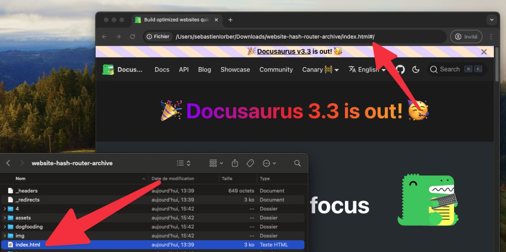

我们很高兴地宣布 **Docusaurus 3.4** 正式发布。

升级过程应该很顺利。我们的[发布流程](/community/release-process)遵循[语义化版本控制](https://semver.org/)，次要版本更新不会包含任何破坏性变更。


<!--truncate-->

## 重点更新

### 标签文件

文档和博客插件原本就支持在 front matter 中使用 `tags` 属性来对相关内容进行分组。但直接在 front matter 中声明标签并不总是理想的方式。

通过 [#10137](https://github.com/facebook/docusaurus/pull/10137)，您现在可以在 `tags.yml` 文件中预定义一组标签：

```yml title="blog/tags.yml"
tag1:
  label: 'Tag 1'
  description: 'Tag 1 description'
  permalink: /tag-1-permalink

tag2:
  label: 'Tag 2'
  description: 'Tag 2 description'
  permalink: /tag-2-permalink
```

这些预定义标签可用于博客或文档文件的 front matter 中：

```md title="blog/2024-05-31-my-blog-post.md"
---
tags: [tag1, tag2]
---

# Title

Content
```

:::tip[保持标签使用一致性]

使用新的 `onInlineTags: 'throw'` 插件选项来强制使用预定义标签，防止贡献者创建不必要的新标签。

:::

### 哈希路由 - 实验性功能

通过 [9859](https://github.com/facebook/docusaurus/pull/9859)，我们新增了一个**实验性**的哈希路由配置选项，该功能对于通过 `file://` 协议本地打开站点进行**离线浏览**非常有用。

```tsx title="docusaurus.config.js"
export default {
  future: {
    experimental_router: 'hash',
  },
};
```

:::warning

**不建议**将此模式用于通过 Web 服务器部署的站点。

:::

启用此模式后，Docusaurus 将退出静态站点渲染模式，转而构建一个客户端单页应用，其中所有路由都带有 `/#/` 前缀。系统会生成一个单独的 `index.html` 文件，用户只需在浏览器中点击该文件即可通过 `file://` 协议本地打开。这使得可以将 Docusaurus 站点打包为 `.zip` 文件分发，读者无需在电脑上安装复杂环境，仅需浏览器即可离线浏览。



尝试浏览我们使用哈希路由构建的 Docusaurus 站点：

- [Docusaurus 官网 - 哈希路由在线部署](https://facebook.github.io/docusaurus/#/)
- [Docusaurus 官网 - 哈希路由可下载的 GitHub 构件](https://github.com/facebook/docusaurus/actions/workflows/build-hash-router.yml)

:::caution[实验性功能]

此功能目前处于**实验阶段**。如果您尝试使用，请通过[此链接](https://github.com/facebook/docusaurus/issues/3825)反馈使用体验。

:::

### 站点存储 - 实验性功能

Docusaurus 使用浏览器的 `localStorage` API 来持久化 UI 状态。

但有时多个使用相同域名的站点会"共享"存储空间，导致**存储键冲突**。这种情况通常发生在两种场景下：

- 同时开发多个 `http://localhost:3000` 站点时
- 在同一个域名下托管多个站点时：例如 `https://example.com/site1/` 和 `https://example.com/site2/`

为此，我们引入了一个新的**实验性** `siteStorage` 配置选项：

```tsx
export default {
  future: {
    experimental_storage: {
      type: 'localStorage',
      namespace: true,
    },
  },
};
```

当设置 `namespace: true` 时，我们会为所有存储键添加哈希后缀，使其基于 `config.url` 和 `config.baseUrl` 成为当前站点专属。例如，`theme` 存储键会变为 `theme-x6f`。您也可以提供自定义后缀 `namespace: 'suffix'`。此外，我们还支持使用 `type: 'sessionStorage'` 来替代默认的 `localStorage`。

:::caution[实验性功能]

此功能目前处于**实验阶段**。如果您尝试使用，请通过[此链接](https://github.com/facebook/docusaurus/pull/10121)向我们反馈使用体验。

:::

## 其他变更

其他值得注意的变更包括：

- [#10151](https://github.com/facebook/docusaurus/pull/10151)：新增土库曼语(tk)主题翻译
- [#10111](https://github.com/facebook/docusaurus/pull/10111)：新增保加利亚语(bg)主题翻译
- [#10168](https://github.com/facebook/docusaurus/pull/10168)：修复多个长期存在的Markdown链接解析问题
- [#10178](https://github.com/facebook/docusaurus/pull/10178)：`/search`页面现在会遵循`contextualSearch: false`设置
- [#10118](https://github.com/facebook/docusaurus/pull/10118)：修复文档生成索引分类卡片描述的错误复数形式
- [#10130](https://github.com/facebook/docusaurus/pull/10130)：修复因尾部斜杠导致的锚点检查器误报问题

完整变更列表请查看**[3.4.0版本更新日志](/changelog/3.4.0)**。