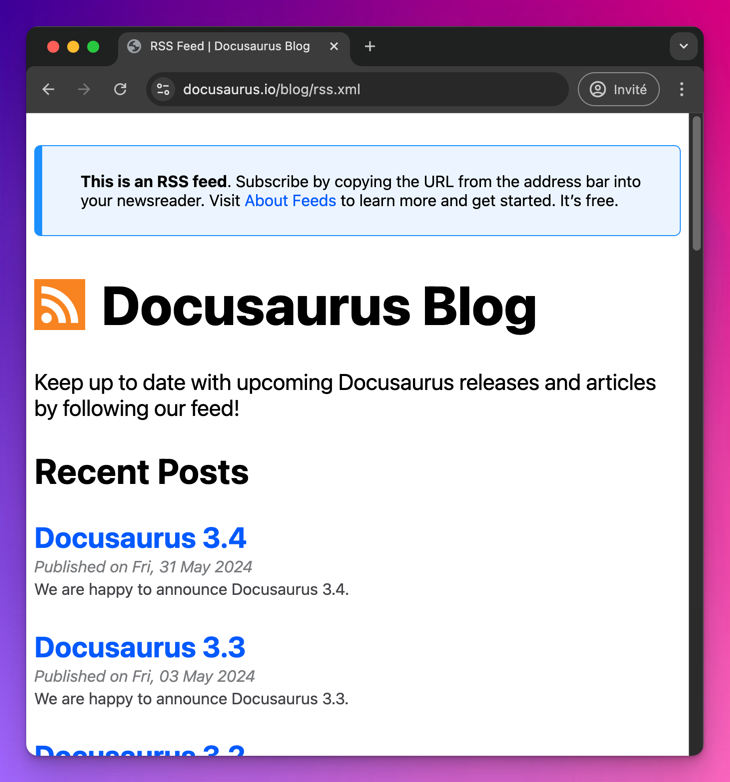

我们很高兴地宣布 **Docusaurus 3.5** 正式发布。

此版本包含许多**激动人心的博客新功能**。

升级过程应该很顺利。我们的[发布流程](/community/release-process)遵循[语义化版本控制](https://semver.org/)，次要版本更新不会包含任何破坏性变更。


## 亮点功能

### 博客作者社交图标

在 [#10222](https://github.com/facebook/docusaurus/pull/10222) 中，我们新增了为博客作者关联社交链接的功能，无论是通过前置元数据声明的内联作者，还是通过 `authors.yml` 文件全局配置的作者均可使用。

```yml title="blog/authors.yml"
slorber:
  name: Sébastien Lorber
  # other author properties...
  # highlight-start
  socials:
    x: sebastienlorber
    linkedin: sebastienlorber
    github: slorber
    newsletter: https://thisweekinreact.com
  # highlight-end
```


系统为预设平台 `x`、`linkedin`、`github` 和 `stackoverflow` 提供了图标和快捷句柄。您也可以为其他平台（如上例中的 `newsletter`）提供完整URL来自定义入口。

### 博客作者专属页面

在 [#10216](https://github.com/facebook/docusaurus/pull/10216) 中，我们为[全局博客作者](/docs/blog#global-authors)（通过 `authors.yml` 声明）新增了专属页面功能，可展示该作者贡献的所有博客文章。

此功能需手动启用，特别适合**多作者博客**。您可以通过设置 `page: true` 属性为特定作者开启：

```yml title="blog/authors.yml"
slorber:
  name: Sébastien Lorber
  # the description will be displayed on the author's page
  description: 'A freelance React and React-Native developer...'
  # highlight-next-line
  page: true # Turns the feature on
```

这将创建一个[专属作者页面](/blog/authors/slorber)，路径为 `/blog/authors/slorber`。


同时会生成一个[作者索引页](/blog/authors)，列出所有博客作者。


详情请参阅[博客作者页面指南](/docs/blog#authors-pages)。

### 博客订阅源样式

在 [#9252](https://github.com/facebook/docusaurus/pull/9252) 中，我们新增了通过自定义XSLT `.xls` 文件为RSS和Atom订阅源[添加样式](https://darekkay.com/blog/rss-styling/)的功能。这能让浏览器将订阅源渲染成更美观的HTML页面样式，而非默认的XML视图。

```js title="website/docusaurus.config.js"
const blogOptions = {
  feedOptions: {
    // highlight-start
    xslt: {
      rss: 'custom-rss.xsl',
      atom: 'custom-atom.xsl',
    },
    // highlight-end
  },
};
```

编写自定义XSLT可能较为复杂，您也可以使用 `xslt: true` 来启用内置样式：

```js title="website/docusaurus.config.js"
const blogOptions = {
  feedOptions: {
    // highlight-start
    xslt: true,
    // highlight-end
  },
};
```



### 博客侧边栏分组

在 [#10252](https://github.com/facebook/docusaurus/pull/10252) 中，我们新增了按年份对博客侧边栏文章进行分组的功能。


此功能现已默认启用，但可通过 `themeConfig.blog.sidebar.groupByYear: false` 禁用。

### 博客一致性选项

我们新增了以下博客选项来强化博客文章的最佳实践：

#### `onInlineAuthors`

我们相信，通过使用在 `authors.yml` 中声明的[全局作者](/docs/blog#global-authors)，可以更轻松地管理大型多作者博客。这尤其有助于避免在多篇博客文章中重复作者信息，并且现在支持生成[作者页面](/docs/blog#authors-pages)。

在 [#10224](https://github.com/facebook/docusaurus/pull/10224) 中，我们新增了 `onInlineAuthors` 选项。使用 `onInlineAuthors: 'throw'` 可以禁止[内联作者](/docs/blog#inline-authors)，并强制统一使用[全局作者](/docs/blog#global-authors)。

#### `onUntruncatedBlogPosts`

我们认为博客文章最好使用[截断标记](/docs/blog#blog-list)（`<!-- truncate -->` 或 `{/* truncate */}`）。在分页列表（博客首页、标签页、作者页）中，这样可以显示更简洁的文章预览，而非完整内容。

在 [#10375](https://github.com/facebook/docusaurus/pull/10375) 中，我们新增了 `onUntruncatedBlogPosts` 选项。使用 `onUntruncatedBlogPosts: 'throw'` 可以强制统一使用[截断标记](/docs/blog#blog-list)。

## 翻译更新

- 🇪🇪 [#10339](https://github.com/facebook/docusaurus/pull/10339): 新增爱沙尼亚语主题翻译。
- 🇮🇩 [#10325](https://github.com/facebook/docusaurus/pull/10325): 新增印尼语主题翻译。
- 🇪🇸 [#10360](https://github.com/facebook/docusaurus/pull/10360): 改进西班牙语主题翻译。
- 🇩🇪 [#10235](https://github.com/facebook/docusaurus/pull/10235): 改进德语主题翻译。
- 🇨🇳 [#10257](https://github.com/facebook/docusaurus/pull/10257): 改进繁体中文（zh-Hant）主题翻译。

## 其他变更

其他值得注意的变更包括：

- [#10369](https://github.com/facebook/docusaurus/pull/10369): 新增对 [pkg.pr.new](https://pkg.pr.new) 持续发布的支持，方便在 StackBlitz 沙盒中测试任意拉取请求的代码。
- [#10376](https://github.com/facebook/docusaurus/pull/10376): 开发环境下也会显示未列出/草稿内容的横幅，避免忘记发布内容。
- [#10335](https://github.com/facebook/docusaurus/pull/10335): Markdown 顶级标题 `# title` 会自动包裹在 `<header>` 中，与 front matter 的 `title: Title` 保持一致性。
- [#10286](https://github.com/facebook/docusaurus/pull/10286): 允许 Docusaurus 插件通过返回 `null` 自行禁用。
- [#10241](https://github.com/facebook/docusaurus/pull/10241): 新增对 [MDX 处理器 `recmaPlugins` 选项](https://mdxjs.com/packages/mdx/#processoroptions)的支持，用于修改 MDX Estree 抽象语法树。
- [#10324](https://github.com/facebook/docusaurus/pull/10324): 文档自动生成的 `_category_.json` 新增 `description` 属性，该描述会显示在生成的索引页上。
- [#10368](https://github.com/facebook/docusaurus/pull/10368): CLI 命令 `docusaurus --version` 现在能正确返回 Docusaurus 版本号。
- [#10240](https://github.com/facebook/docusaurus/pull/10240): Markdown 的 `mdx-code-block` 现在支持缩进。
- [#10219](https://github.com/facebook/docusaurus/pull/10219): 修复 `<TabItem lazy>` 对 `className` 属性的支持。
- [#10313](https://github.com/facebook/docusaurus/pull/10313): 博客相关的 `@docusaurus/theme-common/internal` API 已迁移至 `@docusaurus/plugin-content-blog/client`。
- [#10316](https://github.com/facebook/docusaurus/pull/10316): 文档相关的 `@docusaurus/theme-common/internal` API 已迁移至 `@docusaurus/plugin-content-docs/client`。

查看 **[3.5.0 版本变更日志](/changelog/3.5.0)** 获取完整的变更列表。