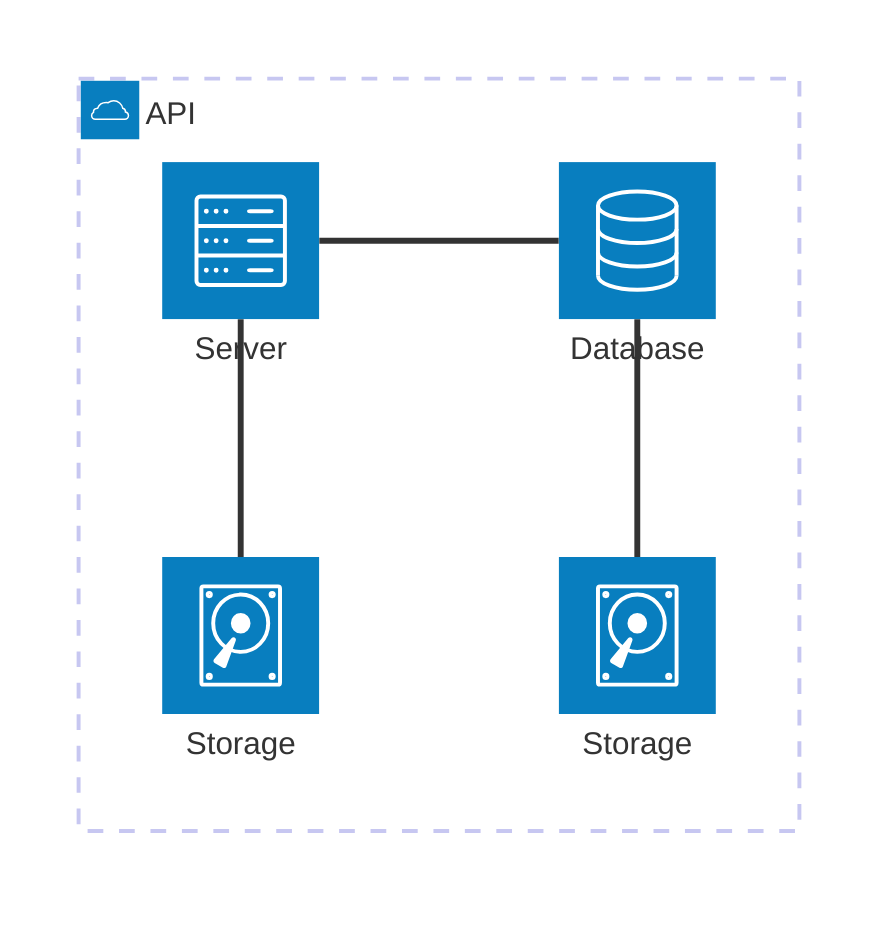

我们很高兴地宣布 **Docusaurus 3.6** 正式发布。

Docusaurus 现在能以 ⚡️⚡️⚡️ **更快的速度** 构建您的站点。

升级过程应该很轻松。我们的[发布流程](/community/release-process)遵循[语义化版本控制](https://semver.org/)，次要版本更新不会包含任何破坏性变更。


## 重点更新

本次版本更新主要聚焦于通过 [Docusaurus Faster](https://github.com/facebook/docusaurus/issues/10556) 项目提升构建性能。

## Docusaurus Faster 计划

[Docusaurus Faster](https://github.com/facebook/docusaurus/issues/10556) 项目的目标是缩短构建时间并降低内存消耗。

我们实施了多项优化措施，并将基础设施升级为基于 Rust 的高性能工具链，主要包括：

- 🦀 [Rspack](https://rspack.dev/)：基于 Rust 的快速 Web 打包工具，几乎可无缝替代 [webpack](https://webpack.js.org/)
- 🦀 [SWC](https://swc.rs/)：极速 Web 编译器，基于 Rust 的 Web 全栈工具链（支持 HTML、CSS、JS）
- 🦀 [Lightning CSS](https://lightningcss.dev/)：超高速 CSS 解析器、转换器、打包工具和压缩器

### 影响范围

采用新基础设施可能产生多方面影响。我们无法穷尽所有细节，以下聚焦主要变化。

为便于您顺利迁移，我们在静态站点输出效果和[浏览器兼容性](/docs/browser-support)方面保持了高度保守的策略。

#### 构建时间

社区站点基准测试显示，生产环境构建速度可提升至 ⚡️**2 到 4 倍**！🔥：

- [React Native 官网](https://github.com/facebook/react-native-website/pull/4268)：提速 3.04 倍 🔥
- [Babel 官网](https://github.com/babel/website/pull/2997)：提速 3.27 倍 🔥
- [Lexical 官网](https://github.com/facebook/lexical/pull/6761)：提速 2 倍 🔥

[如何进行基准测试](https://github.com/facebook/docusaurus/issues/10556#issuecomment-2407671873)

:::note[关于增量构建]

[Rspack 暂未支持持久化缓存](https://rspack.dev/misc/planning/roadmap#persistent-cache)，但已列入开发路线图。我们认为这不会影响 Rspack 的采用，因为 Rspack 的冷启动构建速度通常与启用持久化缓存的 Webpack 热构建相当。

:::

#### 内存消耗

您还将观察到内存占用的改善：

- 新基础设施整体内存消耗更低
- 我们修复了主要影响国际化站点的严重[内存泄漏问题](https://github.com/facebook/docusaurus/pull/10599)
- 新增了[CI 检查](https://github.com/facebook/docusaurus/pull/10601)确保内存占用不会倒退，且我们的站点和初始化模板都能在内存受限环境中构建
- 增加了[内部工具](https://github.com/facebook/docusaurus/pull/10590)用于分析构建过程中各阶段的内存消耗
- [移除了可能掩盖内存泄漏的 `process.exit(0)`](https://github.com/facebook/docusaurus/pull/10410)，这些泄漏可能来自您的代码或第三方插件

#### 其他影响

- HTML 压缩器现在会[在遇到无效 HTML 标记时发出警告](https://github.com/facebook/docusaurus/discussions/10580)
- 静态 HTML 输出体积[缩小约 5%](https://github.com/facebook/docusaurus/pull/10554)
- 部分错误已被新基础设施自动修复

### 采用策略

这套新基础设施属于破坏性变更，但采用是可选功能，不需要升级 Docusaurus 主版本号。

在使用 Docusaurus Faster 前，请先添加这个新包：

```bash npm2yarn
npm install @docusaurus/faster
```

为帮助您**在 Docusaurus v3 下逐步采用**，我们引入了一组可渐进式启用的功能开关。

推荐使用这个简单的布尔快捷方式一次性开启所有功能：

```js
const config = {
  future: {
    experimental_faster: true,
  },
};
```

若某个开关与您的站点不兼容，也可以独立启用各个功能开关：

```ts
const config = {
  future: {
    experimental_faster: {
      swcJsLoader: true,
      swcJsMinimizer: true,
      swcHtmlMinimizer: true,
      lightningCssMinimizer: true,
      rspackBundler: true,
      mdxCrossCompilerCache: true,
    },
  },
};
```

- [`swcJsLoader`](https://github.com/facebook/docusaurus/pull/10435)：使用 [SWC](https://swc.rs/) 转译 JS（替代 [Babel](https://babeljs.io/)）
- [`swcJsMinimizer`](https://github.com/facebook/docusaurus/pull/10441)：使用 [SWC](https://swc.rs/) 压缩 JS（替代 [Terser](https://github.com/terser/terser)）
- [`swcHtmlMinimizer`](https://github.com/facebook/docusaurus/pull/10554)：使用 [SWC](https://swc.rs/) 压缩 HTML 和内联 JS/CSS（替代 [html-minifier-terser](https://github.com/terser/html-minifier-terser)）
- [`lightningCssMinimizer`](https://github.com/facebook/docusaurus/pull/10522)：使用 [Lightning CSS](https://lightningcss.dev/) 压缩 CSS（替代 [cssnano](https://github.com/cssnano/cssnano) 和 [clean-css](https://github.com/clean-css/clean-css)）
- [`rspackBundler`](https://github.com/facebook/docusaurus/pull/10402)：使用 [Rspack](https://rspack.dev/) 打包应用（替代 [webpack](https://webpack.js.org/)）
- [`mdxCrossCompilerCache`](https://github.com/facebook/docusaurus/pull/10479)：MDX 文件只需编译一次即可同时适用于浏览器/Node.js 环境

:::tip[实验性但安全]

无需担心启用这些功能。实验性质仅针对配置选项。

新基础设施经过充分测试且稳定性强，已通过我们的 CI 流水线验证。[Docusaurus 官网](https://docusaurus.io/)已在生产环境使用该方案，我们也计划将其推广至 Meta 其他文档站点。

:::

#### 插件兼容性

新基础设施采用 [Rspack](https://rspack.dev/)。巧合的是，Rspack 与 [webpack](https://webpack.js.org/) 几乎 100% 兼容，不会破坏现有插件生态。

大多数 Docusaurus 插件应能直接在 Rspack 环境下运行，包括那些实现了 [`configureWebpack`](/docs/api/plugin-methods/lifecycle-apis#configureWebpack) 的插件。

但部分插件需进行微调以适配 Rspack。核心原则是避免直接导入 `webpack`，转而使用"动态提供"的 webpack 实例：

```diff
-import webpack from 'webpack';

export default function (context, options) {
  return {
    name: 'custom-docusaurus-plugin',
-   configureWebpack(config, isServer) {
+   configureWebpack(config, isServer, {currentBundler}) {
      return {
        plugins: [
-         new webpack.DefinePlugin({}),
+         new currentBundler.instance.DefinePlugin({}),
        ]
      };
    },
  };
}
```

:::tip[致插件开发者]

请查阅[专项议题](https://github.com/facebook/docusaurus/issues/10572)获取指南与支持。

:::

### 后续计划

这仅是开端：我们将持续推进 [Docusaurus Faster](https://github.com/facebook/docusaurus/issues/10556) 项目，已规划多项性能优化方案。

根据[用户反馈](https://github.com/facebook/docusaurus/issues/10556)，我们计划在Docusaurus的下一主要版本中将此新基础设施设为默认配置。

🙏 我们要特别感谢这些优秀工具的开发者们，正是他们让Docusaurus获得了前所未有的性能提升。尤其要感谢[Rspack团队](https://rspack.dev/misc/team/core-team)在项目推进过程中给予的支持，他们快速响应我们的反馈，并实现了所有必需功能来促成这一变革。👏

## Rsdoctor插件

在[#10588](https://github.com/facebook/docusaurus/pull/10588)中，我们为[Rsdoctor](https://rsdoctor.dev/)开发了Docusaurus插件。该插件能分析Docusaurus的打包阶段，帮助您定位影响打包速度的加载器、插件和压缩器等环节，同时兼容webpack和Rspack。


使用前请先安装[`@docusaurus/plugin-rsdoctor`](/docs/api/plugins/@docusaurus/plugin-rsdoctor)包，然后在配置中添加插件：

```ts title="docusaurus.config.js"
export default {
  plugins: [
    [
      'rsdoctor',
      {
        /* options */
      },
    ],
  ],
};
```

:::tip

建议通过环境变量控制插件启用状态：

```ts title="docusaurus.config.js"
export default {
  plugins: [
    process.env.RSDOCTOR === 'true' && [
      'rsdoctor',
      {
        /* 配置项 */
      },
    ],
  ],
};
```

```bash
# 不启用Rsdoctor的构建
npm run build

# 启用Rsdoctor的构建
RSDOCTOR=true npm run build
```

:::

## Mermaid图表

在[#10510](https://github.com/facebook/docusaurus/pull/10510)中，我们放宽了对[Mermaid图表](https://mermaid.js.org/)的版本限制，现已支持Mermaid 10/11版本。未来新版本预计也将保持兼容，让您可以自主决定升级时机。

现在您可以创建新型图表，例如[架构图](https://mermaid.js.org/syntax/architecture)：



## 翻译更新

- 🇸🇮 [#10551](https://github.com/facebook/docusaurus/pull/10551)：优化斯洛文尼亚语主题翻译
- 🇻🇳 [#10507](https://github.com/facebook/docusaurus/pull/10507)：优化越南语主题翻译
- 🇪🇸 [#10413](https://github.com/facebook/docusaurus/pull/10413)：优化西班牙语主题翻译

## 其他变更

其他重要更新包括：

- [#10586](https://github.com/facebook/docusaurus/pull/10586)：博客支持通过`frontMatter.title_meta`覆盖SEO标题
- [#10600](https://github.com/facebook/docusaurus/pull/10600)：`docusaurus build`和`docusaurus deploy`命令现支持多`--locale`参数
- [#10454](https://github.com/facebook/docusaurus/pull/10454)：`docusaurus-remark-plugin-npm2yarn`升级至[`npm-to-yarn` v3](https://github.com/nebrelbug/npm-to-yarn/releases/tag/v3.0.0)，支持转换`npx`命令
- [#10612](https://github.com/facebook/docusaurus/pull/10612)：Canary版本号改用`3.5.2-canary-<编号>`格式以符合插件`peerDependency`要求
- [#10547](https://github.com/facebook/docusaurus/pull/10547)：`@docusaurus/tsconfig`升级至`target: 'es2022'`
- [#10514](https://github.com/facebook/docusaurus/pull/10514)：移除了初始化模板中的`babel.config.js`以降低Babel定制需求

查看 **[3.6.0 版本变更日志](/changelog/3.6.0)** 获取完整的变更列表。