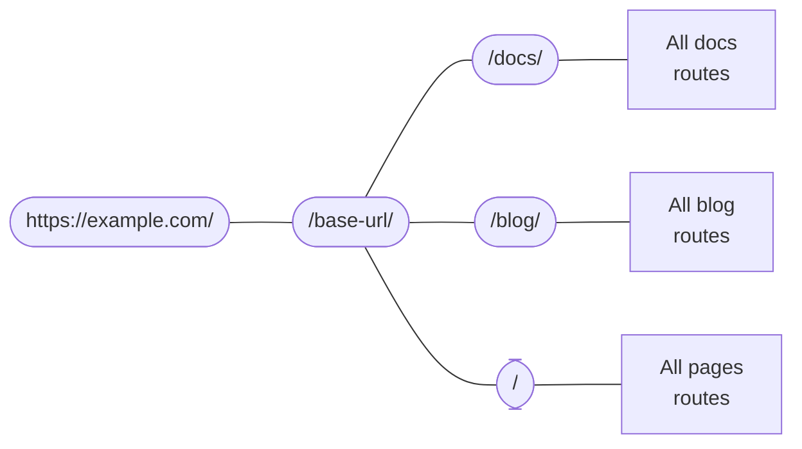

# 路由系统

import Link from '@docusaurus/Link';
import {useLatestVersion, useActiveDocContext} from '@docusaurus/plugin-content-docs/client';
import {useLocation} from '@docusaurus/router';
import BrowserWindow from '@site/src/components/BrowserWindow';

Docusaurus的路由系统遵循单页应用(SPA)规范：一个路由对应一个组件。本节将首先介绍三大内容插件（文档、博客和页面）内部的路由机制，进而深入探讨底层路由系统的工作原理。

## 内容插件路由机制 {#routing-in-content-plugins}

每个内容插件都提供`routeBasePath`配置项，用于定义插件路由的根路径。默认情况下，文档插件将路由挂载在`/docs`下，博客插件使用`/blog`，页面插件则直接使用`/`。其路由结构可理解为：



系统会逐级匹配这个嵌套路由配置。例如当访问`/docs/configuration`时，Docusaurus会先进入`/docs`分支，然后在文档插件创建的子路由中进行搜索。

修改`routeBasePath`可重构站点路由体系。例如在[纯文档模式](../guides/docs/docs-introduction.mdx#docs-only-mode)中，将文档插件的`routeBasePath`设为`'/'`意味着所有文档路由将去除`/docs`前缀，同时仍允许其他插件创建如`/blog`的子路由。

接下来我们具体分析三大插件如何组织各自的"子路由容器"。

### 页面路由 {#pages-routing}

页面路由采用直接映射机制：文件路径即URL路径，不支持其他定制方式。详见[页面文档](../guides/creating-pages.mdx#routing)。

Markdown页面使用`@theme/MDXPage`组件渲染，React页面则直接作为路由组件使用。

### 博客路由 {#blog-routing}

博客插件创建以下路由类型：

- **文章列表页**：`/`, `/page/2`, `/page/3`...
  - 可通过`pageBasePath`选项自定义基础路径
  - 使用`@theme/BlogListPage`组件
- **文章详情页**：`/2021/11/21/algolia-docsearch-migration`, `/2021/05/12/announcing-docusaurus-two-beta`...
  - 由每篇Markdown文章生成
  - 通过`slug`前置元数据完全自定义路由
  - 使用`@theme/BlogPostPage`组件
- **标签列表页**：`/tags`
  - 可通过`tagsBasePath`选项自定义路径
  - 使用`@theme/BlogTagsListPage`组件
- **标签聚合页**：`/tags/adoption`, `/tags/beta`...
  - 根据文章前置元数据中的标签自动生成
  - 基础路径由`tagsBasePath`定义，子路径可通过标签的`permalink`字段定制
  - 使用`@theme/BlogTagsPostsPage`组件
- **归档页**：`/archive`
  - 可通过`archiveBasePath`选项自定义路径
  - 使用`@theme/BlogArchivePage`组件

### 文档路由 {#docs-routing}

文档插件是唯一支持**嵌套路由**的插件。顶层通过[版本路径](../guides/docs/versioning.mdx)注册：`/`, `/next`, `/2.0.0-beta.13`...这些路径提供版本上下文（包括布局和侧边栏），确保切换文档时侧边栏状态得以保持，同时可通过导航栏下拉菜单切换版本而不改变当前文档。使用`@theme/DocPage`组件渲染。

export const URLPath = () => <code>{useLocation().pathname}</code>;

export const FilePath = () => {
  const currentVersion = useActiveDocContext('default').activeVersion.name;
  return <code>{currentVersion === 'current' ? './docs/' : `./versioned_docs/version-${currentVersion}/`}advanced/routing.md</code>;
}

各个文档页面会在导航栏、页脚、侧边栏等由`DocPage`组件提供的布局元素之外的空间进行渲染。例如当前页面<URLPath />是由文件<FilePath />生成的，使用的组件是`@theme/DocItem`。

文档的`slug`前置元数据可自定义路由的最后部分，但基础路由始终由插件的`routeBasePath`和版本`path`决定。

### 文件路径与URL路径 {#file-paths-and-url-paths}

在文档中我们会明确区分文件路径和URL路径。内容插件通常将文件路径直接映射为URL路径，例如`./docs/advanced/routing.md`会转换为`/docs/advanced/routing`。但通过`slug`配置可以使URL与文件结构完全解耦。

在Markdown中编写链接时，需明确是引用_文件路径_还是_URL路径_，Docusaurus会通过以下规则进行判断：

- 带`@site`前缀的路径始终视为资源文件路径
- 带`http(s)://`前缀的路径始终视为URL路径
- 无扩展名的路径视为URL路径（例如在`/docs/advanced/routing`页面的`[page](../plugins)`链接会指向`/docs/plugins`）
- 带`.md(x)`扩展名的路径会尝试解析为Markdown文件对应的URL
- 其他扩展名的路径视为[静态资源](../guides/markdown-features/markdown-features-assets.mdx)并进行打包

以下目录结构可帮助理解文件→URL的映射关系（假设所有页面均未使用slug自定义）：

<details>

<summary>A sample site structure</summary>

```bash
.
├── blog                            # blog plugin has routeBasePath: '/blog'
│   ├── 2019-05-28-first-blog-post.md       # -> /blog/2019/05/28/first-blog-post
│   ├── 2019-05-29-long-blog-post.md        # -> /blog/2019/05/29/long-blog-post
│   ├── 2021-08-01-mdx-blog-post.mdx        # -> /blog/2021/08/01/mdx-blog-post
│   └── 2021-08-26-welcome
│       ├── docusaurus-plushie-banner.jpeg
│       └── index.md                        # -> /blog/2021/08/26/welcome
├── docs                            # docs plugin has routeBasePath: '/docs'; current version has base path '/'
│   ├── intro.md                            # -> /docs/intro
│   ├── tutorial-basics
│   │   ├── _category_.json
│   │   ├── congratulations.md              # -> /docs/tutorial-basics/congratulations
│   │   └── markdown-features.mdx           # -> /docs/tutorial-basics/markdown-features
│   └── tutorial-extras
│       ├── _category_.json
│       ├── manage-docs-versions.md         # -> /docs/tutorial-extras/manage-docs-versions
│       └── translate-your-site.md          # -> /docs/tutorial-extras/translate-your-site
├── src
│   └── pages                       # pages plugin has routeBasePath: '/'
│       ├── index.module.css
│       ├── index.tsx                       # -> /
│       └── markdown-page.md                # -> /markdown-page
└── versioned_docs
    └── version-1.0.0               # version has base path '/1.0.0'
        ├── intro.md                        # -> /docs/1.0.0/intro
        ├── tutorial-basics
        │   ├── _category_.json
        │   ├── congratulations.md          # -> /docs/1.0.0/tutorial-basics/congratulations
        │   └── markdown-features.mdx       # -> /docs/1.0.0/tutorial-basics/markdown-features
        └── tutorial-extras
            ├── _category_.json
            ├── manage-docs-versions.md     # -> /docs/1.0.0/tutorial-extras/manage-docs-versions
            └── translate-your-site.md      # -> /docs/1.0.0/tutorial-extras/translate-your-site
```

</details>

关于内容插件的路由就介绍到这里，现在让我们退一步讨论Docusaurus应用的整体路由机制。

## 路由生成HTML文件 {#routes-become-html-files}

由于Docusaurus是服务端渲染框架，所有生成的路由都会被服务端渲染成静态HTML文件。熟悉[Apache2](https://httpd.apache.org/docs/trunk/getting-started.html)等HTTP服务器行为的开发者会理解其原理：当浏览器请求`/docs/advanced/routing`路由时，服务器会将其解析为对HTML文件`/docs/advanced/routing/index.html`的请求并返回该文件。

`/docs/advanced/routing`路由可能对应`/docs/advanced/routing/index.html`或`/docs/advanced/routing.html`文件。不同托管服务商对尾部斜杠的处理策略不同，详见[尾部斜杠指南](https://github.com/slorber/trailing-slash-guide)。

例如上述目录结构的构建输出如下（忽略其他资源和JS打包文件）：

<details>

<summary>Output of the above workspace</summary>

```bash
build
├── 404.html                      # /404/
├── blog
│   ├── archive
│   │   └── index.html            # /blog/archive/
│   ├── first-blog-post
│   │   └── index.html            # /blog/first-blog-post/
│   ├── index.html                # /blog/
│   ├── long-blog-post
│   │   └── index.html            # /blog/long-blog-post/
│   ├── mdx-blog-post
│   │   └── index.html            # /blog/mdx-blog-post/
│   ├── tags
│   │   ├── docusaurus
│   │   │   └── index.html        # /blog/tags/docusaurus/
│   │   ├── hola
│   │   │   └── index.html        # /blog/tags/hola/
│   │   └── index.html            # /blog/tags/
│   └── welcome
│       └── index.html            # /blog/welcome/
├── docs
│   ├── 1.0.0
│   │   ├── intro
│   │   │   └── index.html        # /docs/1.0.0/intro/
│   │   ├── tutorial-basics
│   │   │   ├── congratulations
│   │   │   │   └── index.html    # /docs/1.0.0/tutorial-basics/congratulations/
│   │   │   └── markdown-features
│   │   │       └── index.html    # /docs/1.0.0/tutorial-basics/markdown-features/
│   │   └── tutorial-extras
│   │       ├── manage-docs-versions
│   │       │   └── index.html    # /docs/1.0.0/tutorial-extras/manage-docs-versions/
│   │       └── translate-your-site
│   │           └── index.html    # /docs/1.0.0/tutorial-extras/translate-your-site/
│   ├── intro
│   │   └── index.html            # /docs/1.0.0/intro/
│   ├── tutorial-basics
│   │   ├── congratulations
│   │   │   └── index.html        # /docs/tutorial-basics/congratulations/
│   │   └── markdown-features
│   │       └── index.html        # /docs/tutorial-basics/markdown-features/
│   └── tutorial-extras
│       ├── manage-docs-versions
│       │   └── index.html        # /docs/tutorial-extras/manage-docs-versions/
│       └── translate-your-site
│           └── index.html        # /docs/tutorial-extras/translate-your-site/
├── index.html                    # /
└── markdown-page
    └── index.html                # /markdown-page/
```

</details>

若`trailingSlash`设为`false`，构建时将生成`intro.html`而非`intro/index.html`。

所有HTML文件都使用绝对URL引用其JS资源，因此必须配置`baseUrl`字段以确保正确加载资源。需注意`baseUrl`不会影响打包输出的文件结构——基础URL位于Docusaurus路由系统的上一层级，可将`url`和`baseUrl`的组合视为Docusaurus站点的实际部署位置。

例如，生成的HTML文件中会包含类似`<link rel="preload" href="/assets/js/runtime~main.7ed5108a.js" as="script">`的链接。由于绝对URL是从主机根路径解析的，若资源包实际部署在`https://example.com/base/`路径下，该链接将错误指向`https://example.com/assets/js/runtime~main.7ed5108a.js`（实际不存在）。通过指定`/base/`作为基础URL，链接才能正确指向`/base/assets/js/runtime~main.7ed5108a.js`。

多语言站点的语言标识也会作为基础URL的一部分。例如`https://docusaurus.io/zh-CN/docs/advanced/routing/`的基础URL是`/zh-CN/`。

## 路由的生成与访问 {#generating-and-accessing-routes}

`addRoute`生命周期操作用于生成路由。它将路由配置注册到路由树中，需要提供路由路径、组件及组件所需的props。props和组件都以路径形式提供给打包器进行`require`调用，正如[架构概述](architecture.mdx)所述，服务端与客户端仅通过临时文件通信。

所有路由都聚合在`.docusaurus/routes.js`中，可通过调试插件的[路由面板](/__docusaurus/debug/routes)查看。

在客户端，我们提供`@docusaurus/router`来访问页面路由。该模块是对[`react-router-dom`](https://www.npmjs.com/package/react-router-dom/v/5.3.0)包的二次导出。例如可使用`useLocation`获取当前页面的[location对象](https://developer.mozilla.org/en-US/docs/Web/API/Location)，或通过`useHistory`访问[history对象](https://developer.mozilla.org/en-US/docs/Web/API/History)（注意这些API虽功能相似，但不同于浏览器原生API，具体用法请参考React Router文档）。

该API具有**SSR安全性**，与仅限浏览器环境的`window.location`不同。

```jsx title="myComponent.js"
import React from 'react';
import {useLocation} from '@docusaurus/router';

export function PageRoute() {
  // React router provides the current component's route, even in SSR
  const location = useLocation();
  return (
    <span>
      We are currently on <code>{location.pathname}</code>
    </span>
  );
}
```

export function PageRoute() {
  const location = useLocation();
  return (
    <span>
      We are currently on <code>{location.pathname}</code>
    </span>
  );
}

<BrowserWindow>

<PageRoute />

</BrowserWindow>

## 规避SPA重定向机制 {#escaping-from-spa-redirects}

Docusaurus构建的是[单页应用](https://developer.mozilla.org/en-US/docs/Glossary/SPA)，路由跳转通过React Router的`history.push()`方法在客户端完成。但此方式的前提是目标URL必须已在路由系统中注册，否则路由系统会拦截路径并显示404页面。

若将HTML文件放入`static`文件夹，它们会被复制到构建输出目录从而成为网站的一部分，但这些路径不属于Docusaurus路由系统。我们提供了`pathname://`协议，可以像外部链接那样以非SPA方式跳转到站内其他路径。

```md
- [pathname:///pure-html](pathname:///pure-html)
```

<BrowserWindow>

- [`pathname:///pure-html`](pathname:///pure-html)

</BrowserWindow>

`pathname://`协议特别适用于引用static文件夹中的内容。例如Docusaurus会将[所有Markdown静态资源转为require()调用](../guides/markdown-features/markdown-features-assets.mdx#static-assets)，使用该协议可保持原始链接形式而不被Webpack哈希处理。

```md title="my-doc.md"


[An asset from the static](pathname:///files/asset.pdf)
```

Docusaurus仅会移除`pathname://`前缀而不对内容做其他处理。