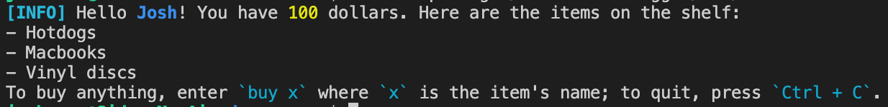

# 📦 日志记录器

一个封装好的日志记录器，用于语义化地格式化控制台消息。

鼓励 Docusaurus 生态系统的包作者使用此包来提供统一的日志格式。

## API

它导出一个默认对象：`logger`。`logger` 具有以下属性：

- 一些有用的颜色。
  - `red`
  - `yellow`
  - `green`
  - `bold`
  - `dim`
- 格式化器。这些函数的签名均为 `(msg: unknown) => string`。请注意，它们的实现不保证稳定性。你只需关心其语义。
  - `path`：格式化文件路径。
  - `url`：格式化 URL。
  - `name`：格式化标识符。
  - `code`：格式化代码片段。
  - `subdue`：淡化文本。
  - `num`：格式化数字。
- `interpolate` 函数。它是一个模板字面量标签。语法如下所示。
- 日志记录函数。所有日志记录函数既可作为普通函数使用（类似于 `console.log` 系列，但只接受一个参数），也可作为模板字面量标签。
  - `info`：打印信息。
  - `warn`：打印需要关注的警告。
  - `error`：打印错误（不一定会终止程序），表示存在严重问题。
  - `success`：打印成功消息。
- `report` 函数。它接受一个 `ReportingSeverity` 值（`ignore`、`log`、`warn`、`throw`），并根据严重性报告消息。

:::warning[关于 `error` 格式化器的注意事项]

请注意，即使 `error` 消息不会挂起程序，也可能会引起混淆。当用户检查日志并发现 `[ERROR]` 时，即使构建成功，他们也会认为出了问题。请谨慎使用。

Docusaurus 仅在抛出错误前打印消息时，或当用户将 `onBrokenLink` 等的报告严重性设置为 `"error"` 时，才会使用 `logger.error`。

此外，`warn` 和 `error` 会为整个消息着色以引起注意。如果要打印关于错误的大段帮助文本，最好使用 `logger.info`。

:::

### 使用模板字面量标签

模板字面量标签会评估模板和嵌入的表达式。`interpolate` 返回一个新字符串，而其他日志记录函数会打印它。以下是典型用法：

```js
import logger from '@docusaurus/logger';

logger.info`Hello name=${name}! You have number=${money} dollars. Here are the ${
  items.length > 1 ? 'items' : 'item'
} on the shelf: ${items}
To buy anything, enter code=${'buy x'} where code=${'x'} is the item's name; to quit, press code=${'Ctrl + C'}.`;
```

嵌入的表达式可以选择在前面加上一个标志，形式为 `[a-z]+=`（几个小写字母，后跟等号，直接位于嵌入表达式之前）。如果表达式前面没有任何标志，则按原样打印。否则，使用以下格式化器之一进行格式化：

- `path=`：`path`
- `url=`：`url`
- `name=`：`name`
- `code=`：`code`
- `subdue=`：`subdue`
- `number=`：`num`

如果表达式是一个数组，则通过 `` `\n- ${array.join('\n- ')}\n` `` 格式化（注意它会自动获得一个前导行结束符）。每个成员自行格式化，项目符号不格式化。因此，你会看到上述消息打印为：

